# Systém pro správu sdílených elektromobilů

**Zápočtový úkol – Softwarové inženýrství**

Návrh a částečná implementace softwarového systému pro správu sdílených
elektromobilů ve městě. Report pokrývá inženýrství požadavků, návrh architektury,
implementaci klíčové komponenty s REST API, testování a návrh evoluce systému.

## Obsah

1. Inženýrství požadavků – role, use case a activity diagramy, funkční a
   nefunkční požadavky, konfliktní požadavky a jejich řešení
2. Softwarová architektura – volba architektury, diagram komponent
3. Implementace komponenty (rezervační služba) a 4. Webové služby (REST API)
5. Testování softwaru – implementované testy a testovací plán
6. Evoluce softwaru – návrh budoucích změn

**Technologie:** Python 3.12, FastAPI, SQLite. Kód je v adresáři `src/`,
spustitelná konzolová ukázka `src/console_demo.py`, REST API `src/main.py`.

---

# 1. Inženýrství požadavků

## 1.1 Přehled systému

Systém slouží ke správě sdílených elektromobilů ve městě. Umožňuje uživatelům
rezervovat vozidla, sledovat jejich stav, generovat faktury za jízdy, spravovat
uživatele a jejich oprávnění a zobrazovat dostupná vozidla na mapě.

Z analýzy scénáře vyplynuly tři hlavní role uživatelů:

- **Běžný uživatel** – zákazník, který si rezervuje a řídí vozidla.
- **Admin** – správce systému, který spravuje uživatele, oprávnění a flotilu.
- **Servisní technik** – pracovník, který se stará o technický stav vozidel
  (nabíjení, údržba, závady).

---

## 1.2 Role a jejich případy užití

### 1.2.1 Běžný uživatel

Případy užití:
1. Registrace a přihlášení
2. Zobrazit dostupná vozidla na mapě
3. Rezervovat vozidlo
4. Zrušit rezervaci
5. Zobrazit historii jízd a faktur

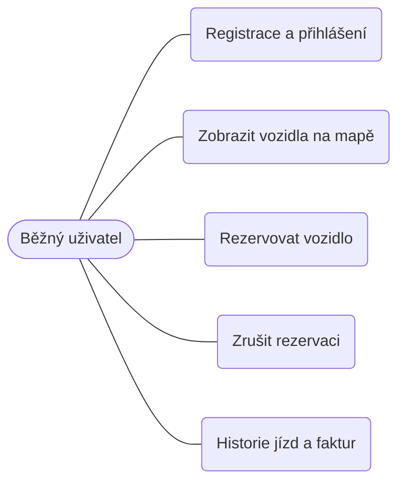

### 1.2.2 Admin

Případy užití:
1. Spravovat uživatele (vytvořit, upravit, zablokovat)
2. Spravovat oprávnění (přiřadit roli)
3. Spravovat flotilu (přidat / odebrat vozidlo)
4. Zobrazit přehled a statistiky provozu

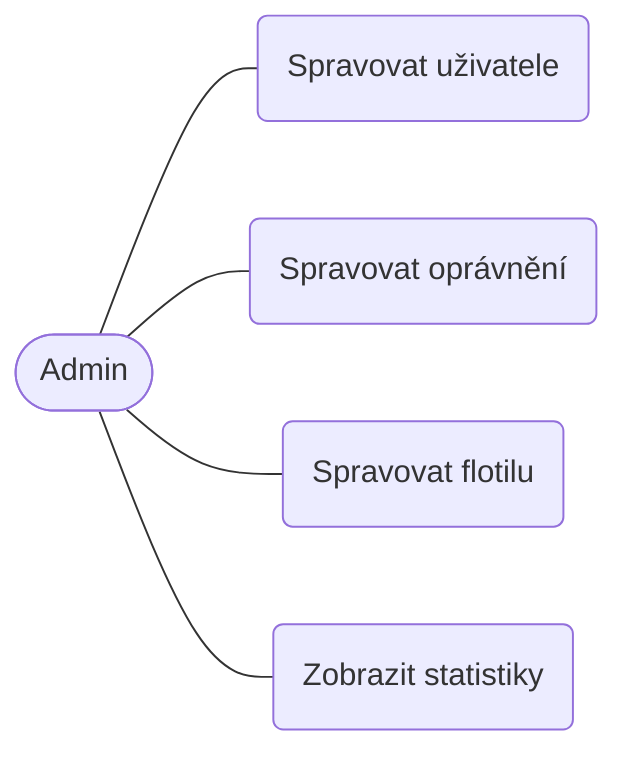

### 1.2.3 Servisní technik

Případy užití:
1. Označit vozidlo do údržby
2. Potvrdit nabití vozidla
3. Nahlásit závadu
4. Zobrazit vozidla vyžadující servis

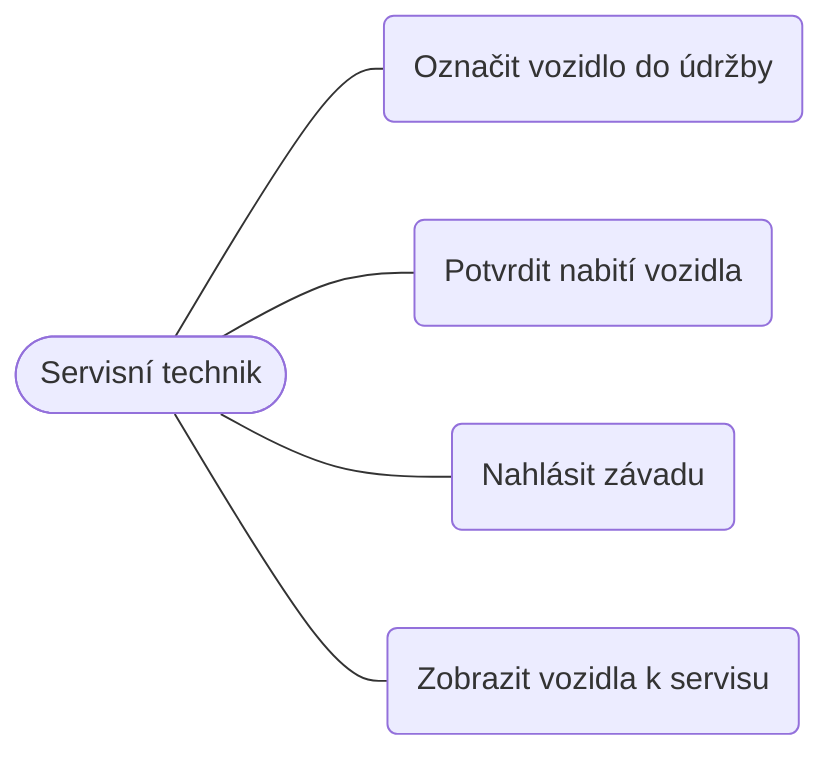

### 1.2.4 Souhrnný pohled na systém

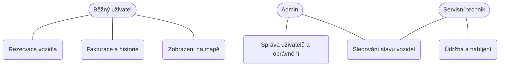

---

## 1.3 Diagramy aktivit

Diagramy aktivit popisují průběh vybraných klíčových případů užití. Podle zadání
nejsou příliš podrobné – zachycují hlavní kroky a rozhodnutí.

### 1.3.1 Rezervace vozidla (běžný uživatel) – klíčový tok

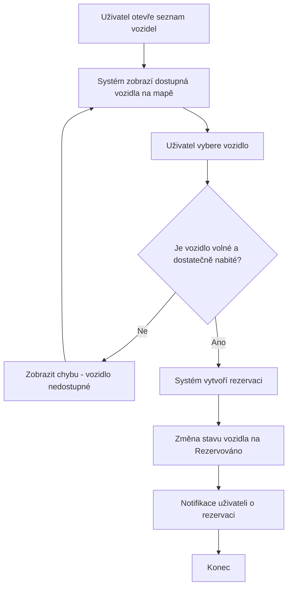

### 1.3.2 Zrušení rezervace (běžný uživatel)

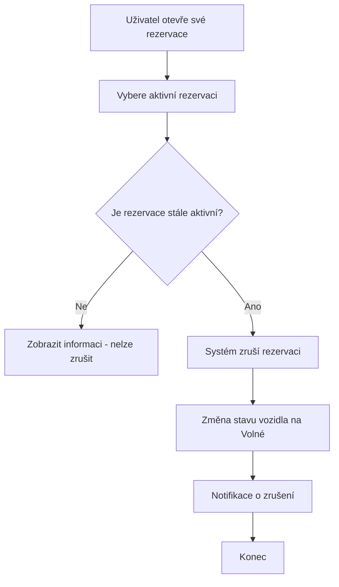

### 1.3.3 Zobrazení historie jízd a faktur (běžný uživatel)

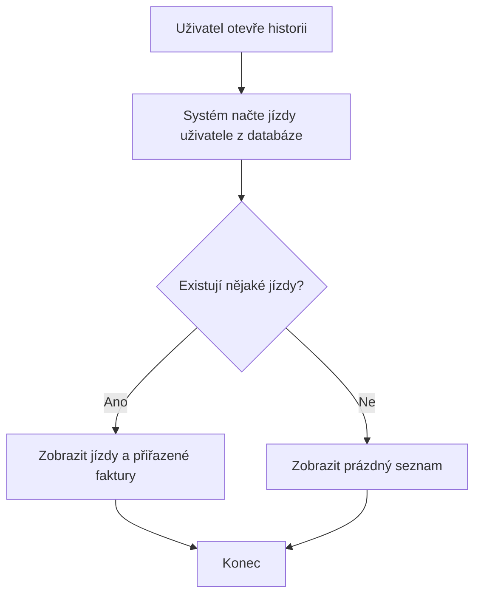

### 1.3.4 Správa uživatelů (admin)

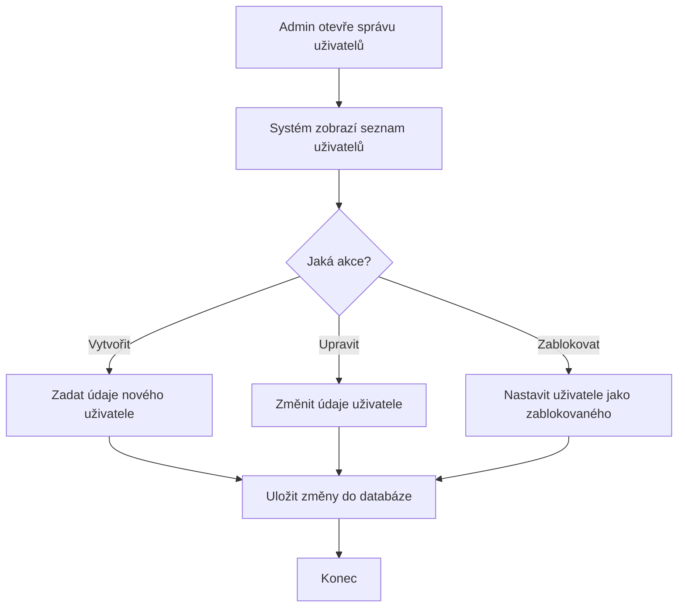

### 1.3.5 Správa oprávnění (admin)

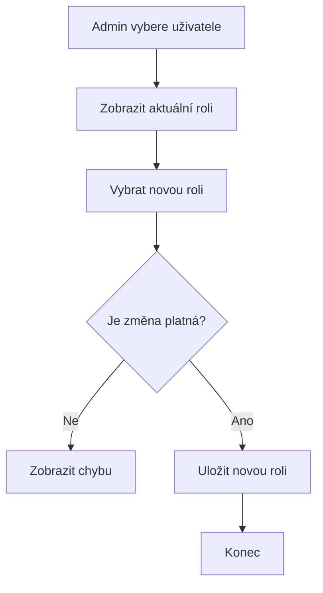

### 1.3.6 Označení vozidla do údržby (servisní technik)

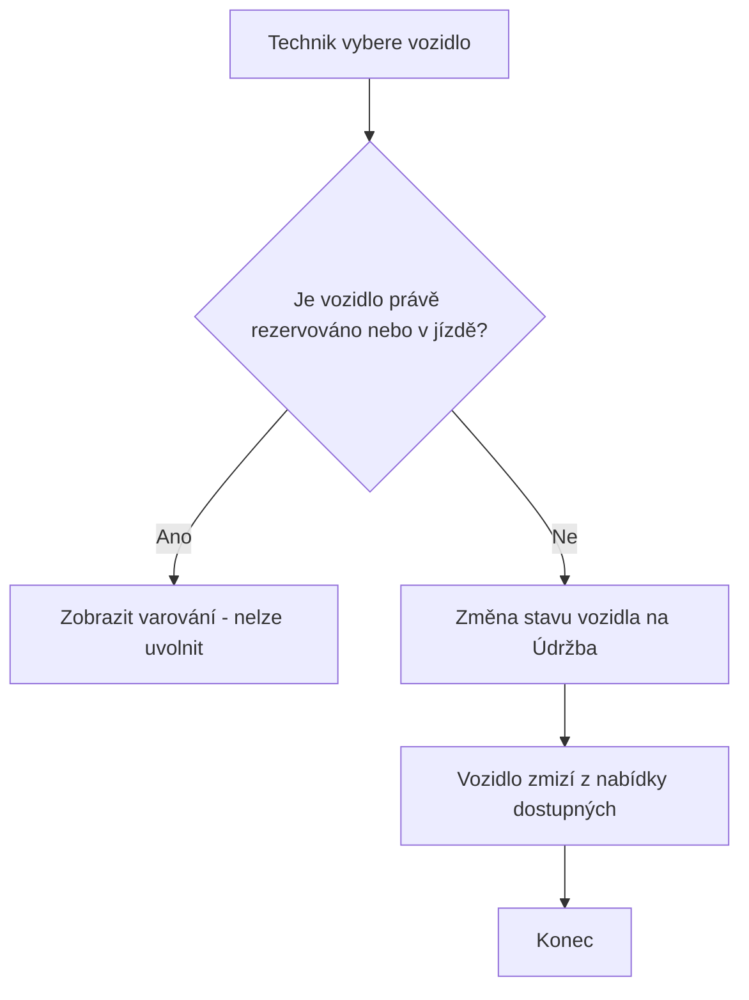

### 1.3.7 Potvrzení nabití vozidla (servisní technik)

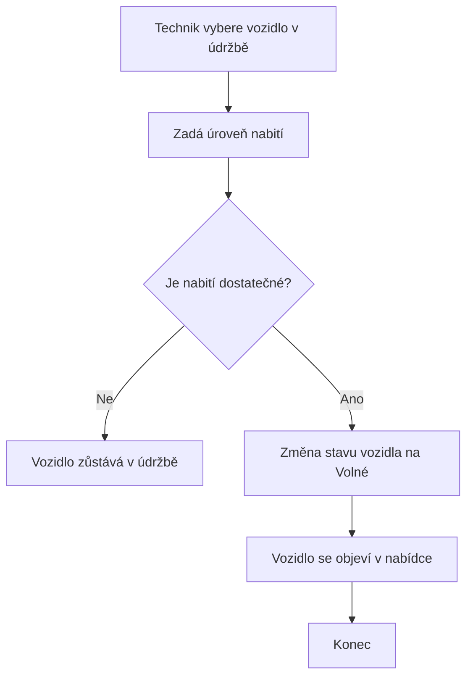

---

## 1.4 Funkční požadavky

Priorita je uvedena podle metody MoSCoW zjednodušené na tři úrovně:
**Vysoká** (musí být), **Střední** (mělo by být), **Nízká** (mohlo by být).

| ID | Požadavek | Priorita | Zdroj | Možná rizika | Závislosti |
|----|-----------|----------|-------|--------------|------------|
| FR1 | Systém umožní registraci a přihlášení uživatele. | Vysoká | Analýza (scénář předpokládá uživatele) | Slabá hesla, zneužití účtu | – |
| FR2 | Systém zobrazí dostupná vozidla na mapě. | Vysoká | Scénář (integrace s mapou) | Výpadek externí mapové služby | FR14 |
| FR3 | Uživatel může rezervovat volné a dostatečně nabité vozidlo. | Vysoká | Scénář (rezervace) | Souběžná rezervace stejného vozidla | FR1, FR14 |
| FR4 | Uživatel může zrušit svou aktivní rezervaci. | Střední | Analýza | Zrušení již ukončené rezervace | FR3 |
| FR5 | Rezervace automaticky vyprší po stanoveném čase, pokud jízda nezačne. | Střední | Analýza (viz konflikt K1) | Nejasná délka platnosti | FR3 |
| FR6 | Uživatel může zahájit a ukončit jízdu z rezervovaného vozidla. | Vysoká | Scénář (historie jízd) | Nekonzistentní stav při chybě | FR3 |
| FR7 | Systém po ukončení jízdy vygeneruje fakturu. | Vysoká | Scénář (fakturace) | Chybný výpočet ceny | FR6 |
| FR8 | Uživatel může zobrazit historii svých jízd a faktur. | Střední | Scénář (historie jízd) | Únik dat jiného uživatele | FR6, FR7 |
| FR9 | Admin může spravovat uživatele (vytvořit, upravit, zablokovat). | Vysoká | Scénář (správa uživatelů) | Náhodné zablokování aktivního uživatele | FR1 |
| FR10 | Admin může měnit role a oprávnění uživatelů. | Vysoká | Scénář (oprávnění) | Eskalace oprávnění | FR9 |
| FR11 | Admin může přidat nebo odebrat vozidlo z flotily. | Střední | Analýza | Odebrání rezervovaného vozidla | FR14 |
| FR12 | Servisní technik může označit vozidlo do údržby. | Vysoká | Scénář (stav vozidel) | Označení právě používaného vozidla | FR14 |
| FR13 | Servisní technik může potvrdit nabití a uvolnit vozidlo. | Střední | Analýza | Uvolnění nedostatečně nabitého vozidla | FR12, FR14 |
| FR14 | Systém sleduje stav každého vozidla (volné / rezervováno / v jízdě / údržba). | Vysoká | Scénář (sledování stavu) | Nekonzistence stavu mezi komponentami | – |

---

## 1.5 Nefunkční požadavky

| ID | Požadavek | Priorita | Zdroj | Možná rizika | Závislosti |
|----|-----------|----------|-------|--------------|------------|
| NFR1 | Odezva REST API bude do 500 ms u 95 % požadavků. | Střední | Analýza (použitelnost) | Zpomalení při vyšší zátěži | NFR4 |
| NFR2 | Dostupnost systému bude alespoň 99,5 % měsíčně. | Střední | Analýza (provozní požadavek) | Výpadek databáze nebo mapy | – |
| NFR3 | Hesla budou uložena v hashované podobě a přístup bude řízen podle rolí. | Vysoká | Analýza (bezpečnost) | Únik databáze, chybná autorizace | FR1, FR10 |
| NFR4 | Systém zvládne alespoň 500 souběžných uživatelů. | Nízká | Analýza (škálovatelnost) | Nedostatečné zdroje | – |
| NFR5 | Osobní údaje budou zpracovány v souladu s GDPR. | Vysoká | Legislativa | Právní postih při porušení | FR8 |
| NFR6 | Systém bude modulární, aby šel snadno rozšiřovat (viz kap. 6). | Střední | Analýza (udržovatelnost) | Těsná provázanost komponent | – |

---

## 1.6 Konfliktní a nejasné požadavky

Během analýzy vzniklo několik nejasností a konfliktů. U každého je uvedeno
navržené řešení.

### K1 – Jak dlouho drží rezervace vozidlo blokované?

**Problém:** Scénář uvádí rezervaci vozidla, ale neříká, jak dlouho zůstane
vozidlo rezervované, pokud uživatel jízdu nezahájí. Dlouhá rezervace blokuje
vozidlo ostatním (konflikt mezi FR3 a dostupností vozidel pro ostatní).

**Řešení:** Zavedeme časový limit platnosti rezervace (např. 15 minut). Po jeho
vypršení se rezervace automaticky zruší a vozidlo se uvolní (požadavek FR5).
Konkrétní hodnota je konfigurovatelná.

### K2 – Platí uživatel za dobu rezervace, nebo jen za jízdu?

**Problém:** Není jasné, zda se účtuje čas rezervace (než uživatel dojde
k vozidlu), nebo až samotná jízda. Obchodní pohled (účtovat rezervaci) je
v konfliktu s očekáváním uživatele (platit jen za jízdu).

**Řešení:** V první verzi se účtuje pouze samotná jízda (od zahájení do ukončení).
Rezervace do vypršení limitu je zdarma. Případné poplatky za rezervaci nad limit
jsou ponechány na pozdější iteraci (viz kap. 6).

### K3 – Může servisní technik zároveň rezervovat vozidla jako běžný uživatel?

**Problém:** Role technika není v zadání přesně ohraničená. Není jasné, zda má
i práva běžného uživatele.

**Řešení:** Role jsou oddělené. Technik má pouze servisní oprávnění. Pokud si
zaměstnanec chce vozidlo i půjčit, musí mít samostatný uživatelský účet. Tím se
předejde záměně provozních a servisních akcí.

### K4 – Lze rezervovat vozidlo s nízkým stavem nabití?

**Problém:** Konflikt mezi FR3 (rezervace) a provozní bezpečností. Málo nabité
vozidlo by nemuselo dojet do cíle.

**Řešení:** Zavedeme minimální úroveň nabití (např. 20 %), pod kterou vozidlo
nelze rezervovat a je automaticky nabídnuto technikovi k nabití. Kontrola je
součástí rezervační logiky (FR3).
# 2. Softwarová architektura

## 2.1 Volba architektury

Pro systém byla zvolena **vrstvená architektura (layered / monolitická)**, nikoli
mikroslužby.

### Zdůvodnění

Zvažovány byly dvě varianty:

**Vrstvená architektura (zvolená):**
- Systém je v této fázi malý a spravuje ho jeden tým – monolit je jednodušší na
  vývoj, nasazení i testování.
- Jednotlivé odpovědnosti se dají čistě oddělit do vrstev (prezentace, logika,
  data), takže kód zůstává přehledný a snadno rozšiřitelný (splňuje NFR6).
- Nižší provozní režie – jedna aplikace, jedna databáze, žádná složitá
  komunikace po síti mezi službami.

**Mikroslužby (zamítnuty pro tuto fázi):**
- Přinesly by zbytečnou složitost (síťová komunikace, distribuované transakce,
  více nasazení) pro systém, který zatím nemá velkou zátěž ani velký tým.
- Mají smysl až při růstu (mnoho měst, vysoká zátěž) – proto jsou uvedeny jako
  možná evoluce v kapitole 6.

Vrstvená architektura je zároveň dobrým výchozím bodem: jednotlivé vrstvy a
komponenty jsou navrženy tak, aby z nich šlo v budoucnu vyčlenit samostatné
služby, pokud to bude potřeba.

## 2.2 Vrstvy systému

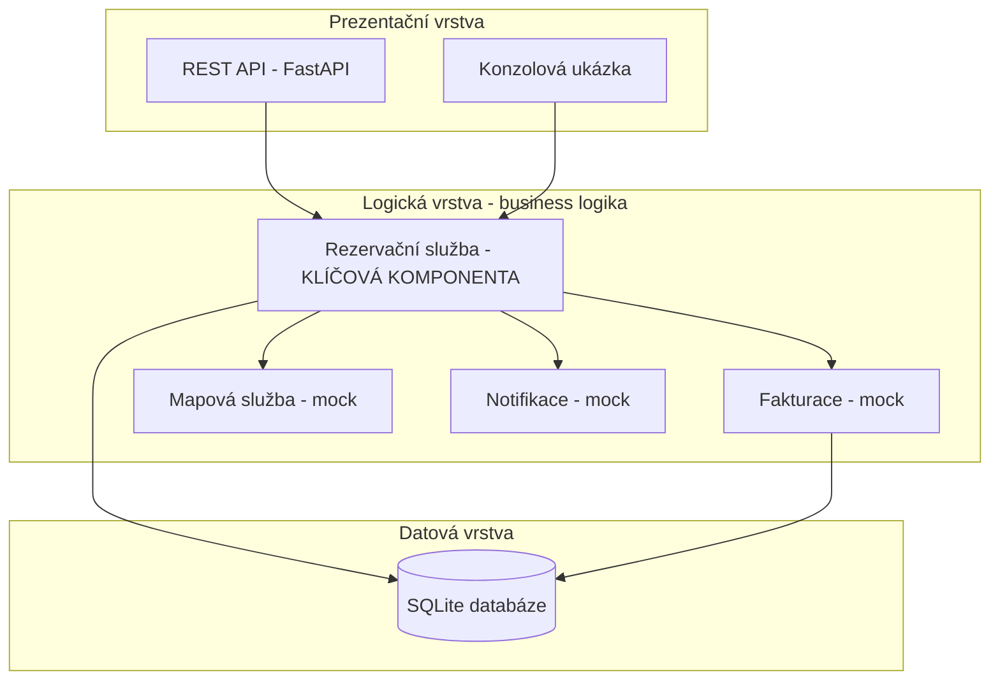

- **Prezentační vrstva** – přijímá požadavky zvenčí. Obsahuje REST API (FastAPI)
  pro webové volání a konzolovou ukázku, která demonstruje komunikaci komponent.
- **Logická vrstva** – jádro systému. Obsahuje rezervační službu (klíčová
  komponenta) a pomocné služby fakturace, mapy a notifikací (v této fázi mocky).
- **Datová vrstva** – SQLite databáze, přístup přes jednoduchý modul `database.py`.

## 2.3 Diagram komponent a interakce

Následující diagram ukazuje hlavní komponenty a to, jak spolu komunikují při
rezervaci a jízdě. Podle zadání nejde o striktní UML.

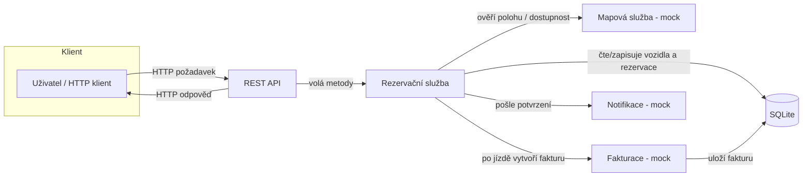

### Popis interakcí

1. **Klient → REST API** – uživatel (nebo curl/Postman) pošle HTTP požadavek,
   např. „rezervuj vozidlo".
2. **REST API → Rezervační služba** – API zavolá odpovídající metodu služby.
   Samo neobsahuje business logiku, jen převádí HTTP na volání služby.
3. **Rezervační služba → Databáze** – služba načte stav vozidla a uživatele,
   ověří podmínky (volné vozidlo, dostatečné nabití, neblokovaný uživatel) a
   uloží novou rezervaci.
4. **Rezervační služba → Mapová služba** – ověří / doplní informace o poloze
   vozidla (v této fázi mock, který vrací připravená data).
5. **Rezervační služba → Fakturace** – po ukončení jízdy si vyžádá vytvoření
   faktury; fakturace spočítá cenu a uloží ji.
6. **Rezervační služba → Notifikace** – odešle uživateli potvrzení (mock tiskne
   na stdout).
7. **REST API → Klient** – vrátí výsledek operace (např. ID rezervace nebo chybu).

## 2.4 Mapování komponent na soubory

Aby report a kód na sebe navazovaly, každá komponenta odpovídá jednomu souboru:

| Komponenta | Soubor | Odpovědnost |
|------------|--------|-------------|
| Datová vrstva | `src/database.py` | Vytvoření tabulek a přístup k datům (SQLite) |
| Rezervační služba (klíčová) | `src/reservation_service.py` | Rezervace, kontroly stavu, jízdy |
| Fakturace (mock) | `src/billing.py` | Výpočet a uložení faktury |
| Mapová služba (mock) | `src/maps.py` | Poloha a dostupnost vozidel |
| Notifikace (mock) | `src/notifications.py` | Odeslání zpráv uživateli |
| Konzolová ukázka | `src/console_demo.py` | Demonstrace komunikace komponent |
| REST API | `src/main.py` | HTTP rozhraní nad rezervační službou |
# 3. Implementace komponenty a 4. Webové služby

## 3.1 Implementovaná komponenta

Klíčovou implementovanou komponentou je **rezervační služba**
(`src/reservation_service.py`), třída `RezervacniSluzba`. Zapouzdřuje business
logiku systému a je napojena na datovou vrstvu i na ostatní komponenty.

Hlavní metody a jejich kontroly:

| Metoda | Co dělá | Kontroly |
|--------|---------|----------|
| `zobraz_dostupna_vozidla()` | Vrátí volná vozidla a předá je mapě | – |
| `vytvor_rezervaci(uzivatel_id, vozidlo_id)` | Vytvoří rezervaci | uživatel existuje a není zablokovaný, vozidlo je volné, nabití ≥ 20 % (K4) |
| `zrus_rezervaci(rezervace_id)` | Zruší rezervaci a uvolní vozidlo | rezervace je aktivní |
| `zahaj_jizdu(rezervace_id)` | Zahájí jízdu | rezervace je aktivní a nevypršela (K1) |
| `ukonci_jizdu(jizda_id, ujeto_km)` | Ukončí jízdu a vytvoří fakturu | jízda ještě neskončila |
| `historie_jizd(uzivatel_id)` | Vrátí jízdy uživatele | – |

Každá metoda vrací slovník `{"ok": ..., "zprava": ...}` (případně s dalšími údaji
jako `rezervace_id`), takže výsledek se dá stejně použít v konzoli i v REST API.

## 3.2 Komunikace s ostatními komponentami

Rezervační služba komunikuje s dalšími částmi systému. Ostatní komponenty jsou
v této fázi mocky, které tisknou na standardní výstup, takže je komunikace vidět.

Výstup konzolové ukázky (`src/console_demo.py`) při rezervaci a jízdě:

```
[MAPA] Zobrazuji dostupna vozidla na mape:
   - Auto A na pozici 50.08 14.42 (nabiti 80 %)
   - Auto B na pozici 50.09 14.43 (nabiti 15 %)
[MAPA] Overuji polohu vozidla Auto A
[NOTIFIKACE] Uzivatel c. 1 -> Vase rezervace vozidla byla vytvorena.
...
[FAKTURACE] Vytvarim fakturu za jizdu c. 1 - ujeto 12 km, castka 60.0 Kc
[NOTIFIKACE] Uzivatel c. 1 -> Vase jizda byla ukoncena a vyuctovana.
```

Z výstupu je vidět, že rezervační služba postupně volá **mapovou službu**
(zobrazení a ověření polohy), **notifikace** (potvrzení uživateli) a
**fakturaci** (vytvoření faktury po jízdě). Také je vidět kontrola z konfliktu
K4 – vozidlo s nízkým nabitím (Auto B) systém odmítne rezervovat.

## 4.1 REST API

Nad rezervační službou je jednoduché REST API (`src/main.py`, FastAPI).
Endpointy jen převádějí HTTP požadavky na volání služby.

| Metoda a cesta | Popis | Tělo požadavku |
|----------------|-------|----------------|
| `GET /vozidla` | Seznam dostupných vozidel | – |
| `POST /rezervace` | Vytvoří rezervaci | `{"uzivatel_id": 1, "vozidlo_id": 1}` |
| `POST /rezervace/{id}/zruseni` | Zruší rezervaci | – |
| `POST /jizdy` | Zahájí jízdu | `{"rezervace_id": 1}` |
| `POST /jizdy/{id}/ukonceni` | Ukončí jízdu a vyfakturuje | `{"ujeto_km": 8}` |
| `GET /uzivatele/{id}/historie` | Historie jízd uživatele | – |

Chybové stavy (např. málo nabité vozidlo) vrací HTTP kód **400** s popisem chyby.
FastAPI navíc automaticky vytvoří interaktivní dokumentaci na `/docs`.

Spuštění serveru (ve složce `src`):

```
uvicorn main:app --reload
```

## 4.2 Ukázka volání (curl)

Následující volání byla skutečně spuštěna proti běžícímu API. Skript je také
v souboru `curl_ukazky.sh`.

```
### 1) GET /vozidla
[{"id":1,"nazev":"Auto A","nabiti":80,"lat":50.08,"lon":14.42},
 {"id":2,"nazev":"Auto B","nabiti":15,"lat":50.09,"lon":14.43}]

### 2) POST /rezervace  -d '{"uzivatel_id":1,"vozidlo_id":1}'
{"ok":true,"zprava":"Rezervace vytvorena.","rezervace_id":1}

### 3) POST /jizdy  -d '{"rezervace_id":1}'
{"ok":true,"zprava":"Jizda zahajena.","jizda_id":1}

### 4) POST /jizdy/1/ukonceni  -d '{"ujeto_km":8}'
{"ok":true,"zprava":"Jizda ukoncena.","faktura_id":1}

### 5) GET /uzivatele/1/historie
[{"jizda_id":1,"vozidlo_id":1,"ujeto_km":8.0,
  "cas_start":"...","cas_konec":"..."}]

### 6) POST /rezervace  -d '{"uzivatel_id":1,"vozidlo_id":2}'   (nizke nabiti)
{"detail":"Vozidlo ma prilis nizke nabiti."}     [HTTP 400]
```

Poslední volání ukazuje, že se pravidlo o minimálním nabití (konflikt K4)
uplatní i přes REST API, nejen v rezervační službě samotné.
# 5. Testování softwaru

## 5.1 Implementované testy

Pro rezervační komponentu je napsáno 8 testů (`src/test_reservation.py`),
jednotkových i integračních. Všechny procházejí (`8 passed`).

| Test | Typ | Co ověřuje |
|------|-----|------------|
| `test_rezervace_uspesna` | jednotkový | Úspěšná rezervace, vozidlo přejde do stavu „rezervováno" |
| `test_rezervace_malo_nabiteho_vozidla` | jednotkový | Odmítnutí vozidla pod 20 % nabití (K4) |
| `test_rezervace_neexistujiciho_vozidla` | jednotkový | Ošetření neexistujícího vozidla |
| `test_rezervace_zablokovaneho_uzivatele` | jednotkový | Zablokovaný uživatel nemůže rezervovat |
| `test_zruseni_rezervace_uvolni_vozidlo` | jednotkový | Po zrušení je vozidlo zase volné |
| `test_zahajeni_jizdy_po_vyprseni_rezervace` | jednotkový | Vypršelá rezervace (K1) nedovolí jízdu |
| `test_cely_tok_rezervace_az_faktura` | integrační | Celý tok rezervace → jízda → faktura, kontrola částky |
| `test_api_rezervace_pres_endpoint` | integrační | REST API přes TestClient (GET /vozidla, POST /rezervace) |

Testy používají databázi v paměti (`:memory:`), takže jsou rychlé, nezávislé na
sobě a nemění reálná data. API test si na začátku vytvoří čistou databázi.

## 5.2 Plán testování celého systému

### 5.2.1 Typy testů

- **Jednotkové testy** – testují jednotlivé funkce a metody v izolaci (např.
  kontroly v rezervační službě). Rychlé, pouštějí se při každé změně kódu.
- **Integrační testy** – testují spolupráci komponent (rezervační služba +
  databáze + fakturace + API). Odhalí chyby v rozhraních mezi komponentami.
- **End-to-end (E2E) testy** – testují celý systém z pohledu uživatele, od HTTP
  požadavku po zápis do databáze. U webového API se dají realizovat voláním
  reálných endpointů (např. přes nástroj jako Postman nebo automatizovaně).
- **Akceptační testování** – ověřuje, že systém splňuje požadavky zadavatele.
  Vychází z funkčních požadavků (kap. 1.4), např. „uživatel dokáže rezervovat a
  odjet vozidlem". Provádí se se zadavatelem před nasazením.

### 5.2.2 Metody návrhu testů

- **Blackbox (černá skříňka)** – testy se navrhují jen podle vstupů a
  očekávaných výstupů, bez znalosti vnitřní implementace. Vhodné pro akceptační
  a API testy. Používá se např. testování hraničních hodnot (nabití přesně
  19 %, 20 %, 21 %) a rozdělení do tříd ekvivalence.
- **Whitebox (bílá skříňka)** – testy vycházejí ze znalosti kódu a snaží se
  projít všechny větve. Např. u metody `vytvor_rezervaci` pokrýt každou
  podmínku (neexistující uživatel, zablokovaný uživatel, obsazené vozidlo,
  nízké nabití, úspěch). Měří se pokrytí kódu (code coverage).

### 5.2.3 Další techniky zajištění kvality

- **Statická analýza** – nástroje jako `flake8`, `pylint` nebo `mypy` (kontrola
  typů) odhalí chyby a nekonzistence bez spuštění kódu. Zařazují se do CI.
- **CI/CD datovod (pipeline)** – při každém pushnutí do repozitáře se
  automaticky spustí statická analýza a testy. Pokud projdou, kód se může
  automaticky nasadit (např. GitHub Actions, GitLab CI). Zabraňuje tomu, aby se
  do hlavní větve dostal nefunkční kód.
- **Strategie shift-left** – testování a kontrola kvality se posouvají co
  nejdříve do vývoje (psaní testů spolu s kódem, kontrola už při psaní), místo
  aby se testovalo až na konci. Chyby se tak odhalí dříve a levněji.
- **Code review** – změny prochází revizí druhého vývojáře před sloučením.

### 5.2.4 Návrh testovací pyramidy pro tento systém

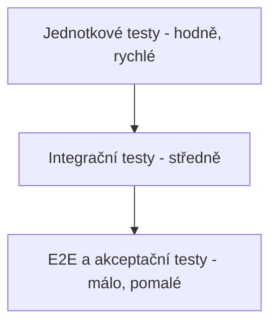

Základ tvoří velké množství rychlých jednotkových testů, nad nimi méně
integračních a nahoře jen několik E2E a akceptačních testů. Tím se udrží rychlá
zpětná vazba a zároveň jistota, že systém funguje jako celek.
# 6. Evoluce softwaru

V další iteraci vývoje bude potřeba systém rozšířit. Níže jsou tři navržené změny
a jejich dopad na architekturu a na implementovanou rezervační komponentu.

Klíčové zjištění: díky zvolené **vrstvené architektuře** a tomu, že ostatní části
(fakturace, mapa, notifikace) jsou volané přes jasně dané rozhraní, se u většiny
změn **rezervační služba téměř nemění** – vyměňují se hlavně mock komponenty za
reálné implementace.

## 6.1 Změna 1 – Nový typ uživatele: firemní správce

**Popis:** Přibude role „firemní správce", který spravuje více zaměstnaneckých
účtů pod jednou firmou a vidí souhrnnou fakturaci za všechny své zaměstnance.

**Dopad na architekturu:**
- Do modelu uživatelů přibude vazba „firma" a nová role.
- Fakturace musí umět seskupit jízdy více uživatelů pod jednu firemní fakturu.

**Dopad na kód:**
- V `database.py` přibude tabulka `firmy` a sloupec `firma_id` u uživatelů.
- V rezervační službě se rozšíří kontrola oprávnění (nová role), ale samotná
  logika rezervace zůstává stejná.
- Nejvíc práce je ve fakturační komponentě (souhrnná faktura), ne v jádru.

**Náročnost:** střední.

## 6.2 Změna 2 – Integrace s reálnou platební bránou

**Popis:** Mock fakturace (`billing.py`) se nahradí napojením na reálnou platební
bránu (např. Stripe, GoPay), která provede skutečnou platbu.

**Dopad na architekturu:**
- Fakturace se stane skutečnou externí integrací – přibude síťová komunikace,
  potvrzování plateb a ošetření chyb (platba se nemusí povést).
- Vhodné je zpracovat platbu asynchronně a stav platby ukládat.

**Dopad na kód:**
- Změní se pouze `billing.py` – funkce `vytvor_fakturu` zůstane navenek stejná
  (stejné parametry), jen uvnitř zavolá platební bránu.
- **Rezervační služba se nemění vůbec**, protože fakturaci volá přes stejné
  rozhraní. To je hlavní výhoda oddělení komponent.

**Náročnost:** střední (hlavně kvůli ošetření chyb a bezpečnosti plateb).

## 6.3 Změna 3 – Integrace s reálnou mapovou službou

**Popis:** Mock mapy (`maps.py`) se nahradí reálnou mapovou službou (např.
Mapy.cz nebo Google Maps API), včetně vyhledání nejbližšího vozidla podle polohy
uživatele.

**Dopad na architekturu:**
- Mapová služba se stane externí integrací (NFR – riziko výpadku, nutnost
  ošetřit nedostupnost, případně cache).
- Přibude funkce „najdi nejbližší vozidlo", která potřebuje polohu uživatele.

**Dopad na kód:**
- Změní se `maps.py` – funkce `zobraz_na_mape` a `over_dostupnost` získají reálnou
  implementaci. Přibude nová funkce pro nejbližší vozidlo.
- V rezervační službě lze přidat nepovinný krok „doporuč nejbližší vozidlo", ale
  stávající metody se nemusí měnit.

**Náročnost:** střední.

## 6.4 Shrnutí dopadů

| Změna | Hlavní zásah | Rezervační služba | Náročnost |
|-------|--------------|-------------------|-----------|
| Firemní správce | databáze + fakturace | malá úprava (oprávnění) | střední |
| Platební brána | billing.py | beze změny | střední |
| Reálná mapa | maps.py | volitelné rozšíření | střední |

Žádná ze změn nevyžaduje přepsání jádra systému. To potvrzuje, že vrstvená
architektura s oddělenými komponentami byla pro tento systém dobrá volba a
usnadňuje budoucí rozvoj. Při výrazném růstu (mnoho měst, vysoká zátěž) by dalším
krokem mohl být postupný přechod vybraných komponent (fakturace, mapa) na
samostatné **mikroslužby** – architektura je na to připravena.
