# Systém pro správu sdílených elektromobilů

**Zápočtový úkol – Softwarové inženýrství**

Návrh a částečná implementace softwarového systému pro správu sdílených
elektromobilů ve městě. Report pokrývá inženýrství požadavků, návrh architektury,
implementaci klíčové komponenty s REST API, testování a návrh evoluce systému.

## Obsah

1. Inženýrství požadavků – role, use case a activity diagramy, funkční a
   nefunkční požadavky, konfliktní požadavky a jejich řešení
2. Softwarová architektura – volba architektury, diagram komponent
3. Implementace komponenty (rezervační služba) a 4. Webové služby (REST API)
5. Testování softwaru – implementované testy a testovací plán
6. Evoluce softwaru – návrh budoucích změn

**Technologie:** Python 3.12, FastAPI, SQLite, vanilla JS/nginx (frontend),
Docker Compose (nasazení). Backend je v adresáři `src/` (spustitelná
konzolová ukázka `src/console_demo.py`, REST API `src/main.py`), webový
frontend v adresáři `frontend/`.

---

# 1. Inženýrství požadavků

## 1.1 Přehled systému

Systém slouží ke správě sdílených elektromobilů ve městě. Umožňuje uživatelům
rezervovat vozidla, sledovat jejich stav, generovat faktury za jízdy, spravovat
uživatele a jejich oprávnění a zobrazovat dostupná vozidla na mapě. Kromě REST
API existuje i jednoduchý webový frontend (statické HTML/JS), přes který se dá
celý tok (přihlášení, rezervace, jízda, administrace, servis) reálně vyzkoušet
v prohlížeči.

Z analýzy scénáře vyplynuly tři hlavní role uživatelů:

- **Běžný uživatel** – zákazník, který si rezervuje a řídí vozidla.
- **Admin** – správce systému, který spravuje uživatele, oprávnění a flotilu.
- **Servisní technik** – pracovník, který se stará o technický stav vozidel
  (nabíjení, údržba, závady).

---

## 1.2 Role a jejich případy užití

### 1.2.1 Běžný uživatel

Případy užití:
1. Registrace a přihlášení
2. Zobrazit dostupná vozidla na mapě
3. Rezervovat vozidlo
4. Sledovat odpočet do vypršení rezervace
5. Zrušit rezervaci
6. Zobrazit historii jízd a faktur

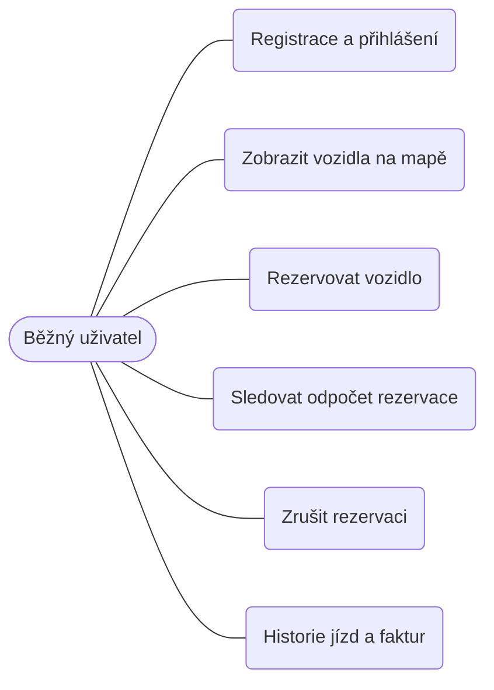

### 1.2.2 Admin

Případy užití:
1. Vytvořit nového uživatele
2. (Od)blokovat uživatele
3. Změnit roli uživatele
4. Spravovat flotilu (přidat / odebrat vozidlo)
5. Zobrazit přehled všech faktur, filtrovatelný podle uživatele a vozidla
6. Vidět, kdo má které vozidlo právě rezervované nebo v jízdě

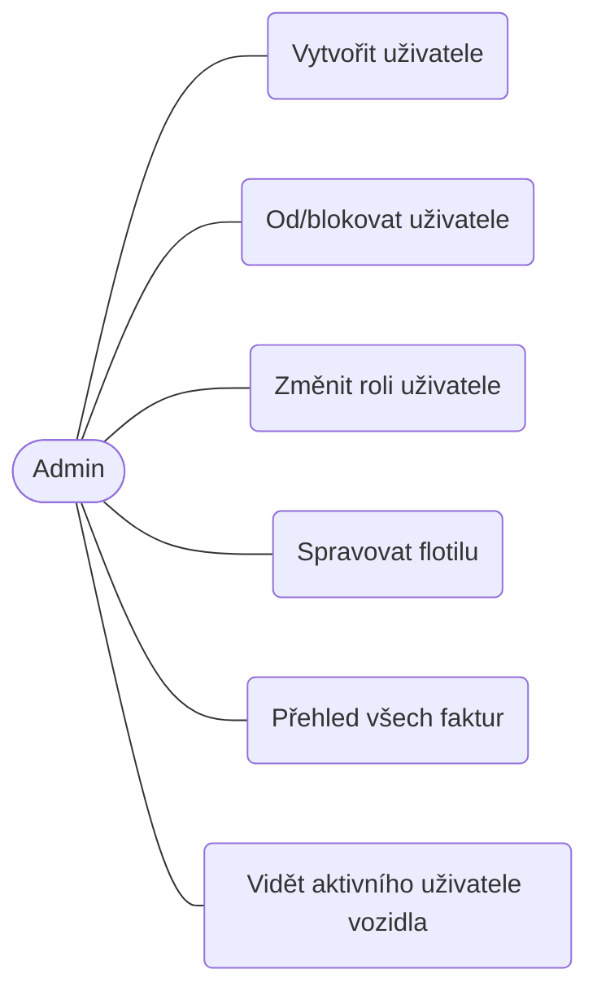

### 1.2.3 Servisní technik

Případy užití:
1. Označit vozidlo do údržby
2. Potvrdit nabití vozidla
3. Nahlásit závadu
4. Zobrazit vozidla vyžadující servis
5. Rezervovat vozidlo pro testovací jízdu (viz konflikt K3)

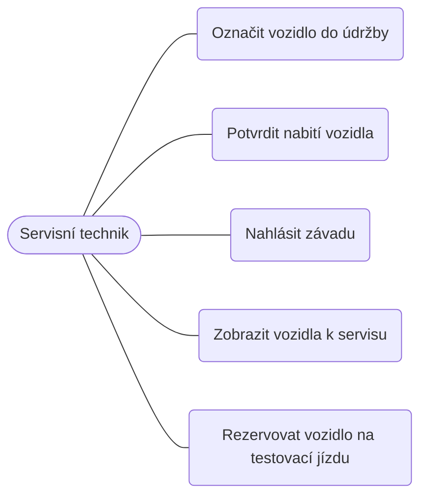

### 1.2.4 Souhrnný pohled na systém

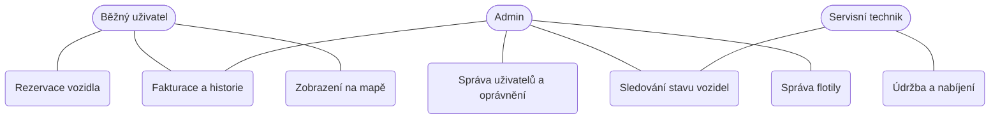

---

## 1.3 Diagramy aktivit

Diagramy aktivit popisují průběh vybraných klíčových případů užití. Podle zadání
nejsou příliš podrobné – zachycují hlavní kroky a rozhodnutí.

### 1.3.1 Rezervace vozidla (běžný uživatel) – klíčový tok

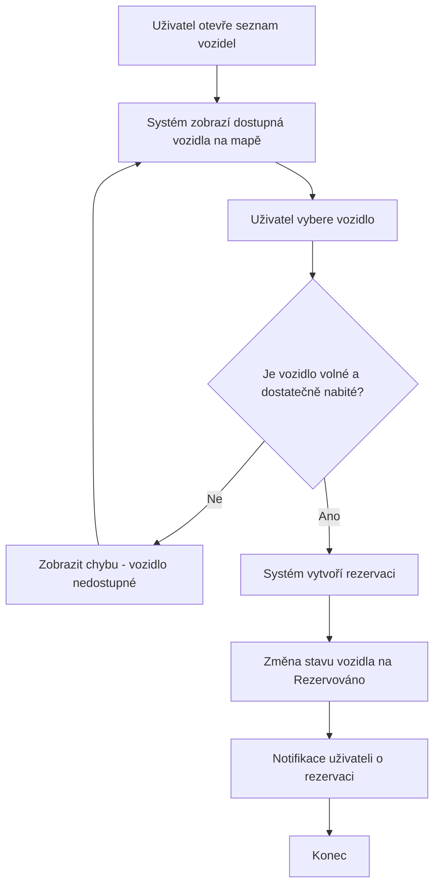

### 1.3.2 Zrušení rezervace (běžný uživatel)

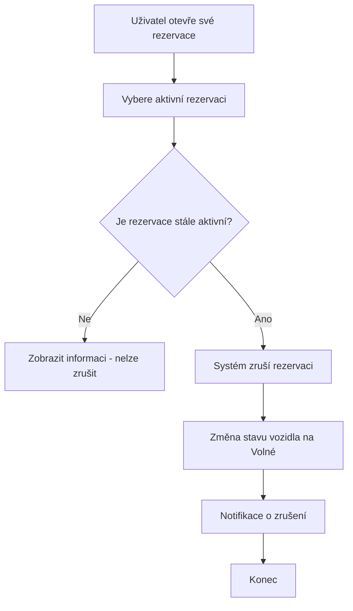

### 1.3.3 Zobrazení historie jízd a faktur (běžný uživatel)

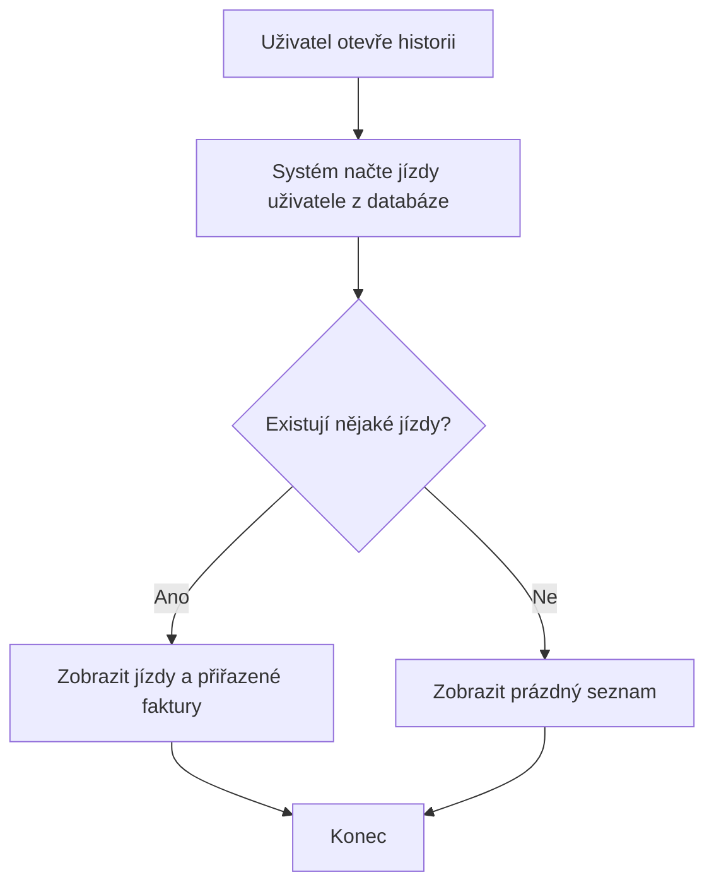

### 1.3.4 Správa uživatelů (admin)

Autorizace každé akce je řešena stejně jako u K1: server dohledá uživatele
podle poslaného `admin_id` a ověří, že má roli `admin` (viz K5).

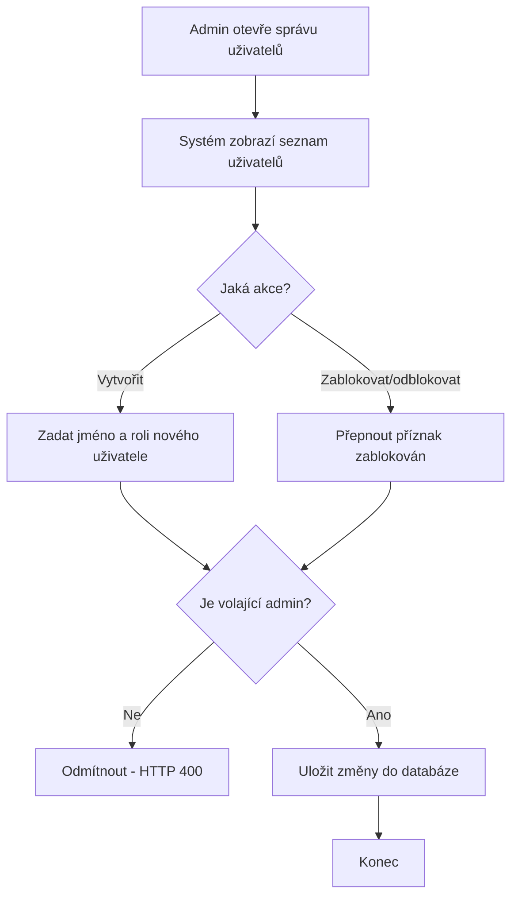

### 1.3.5 Správa oprávnění (admin)

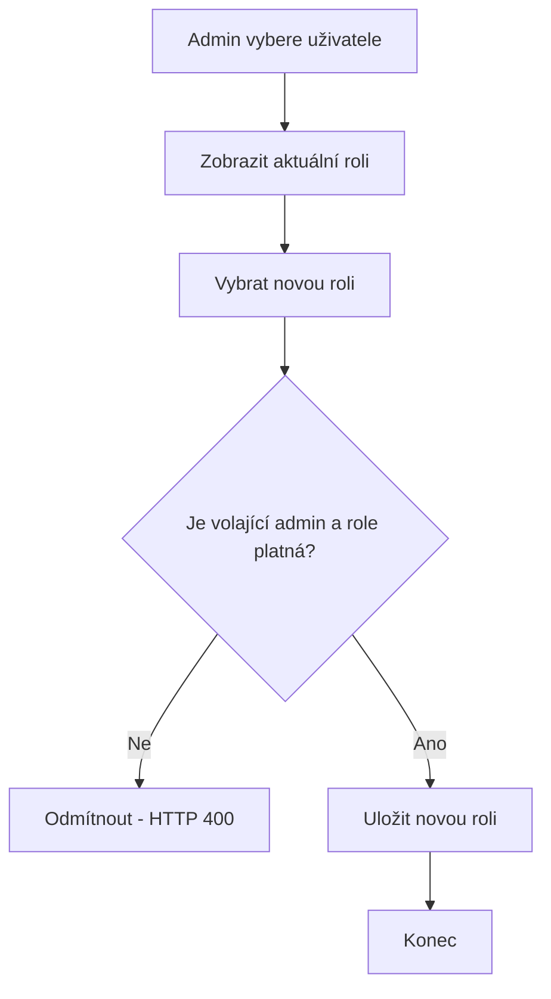

### 1.3.6 Označení vozidla do údržby (servisní technik)

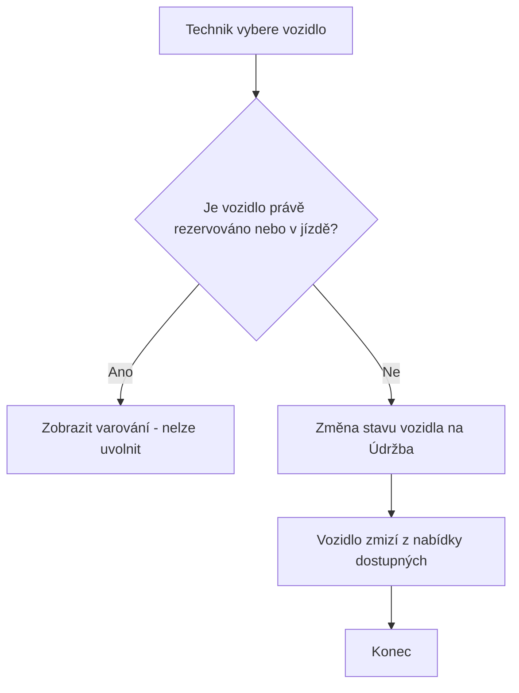

### 1.3.7 Potvrzení nabití vozidla (servisní technik)

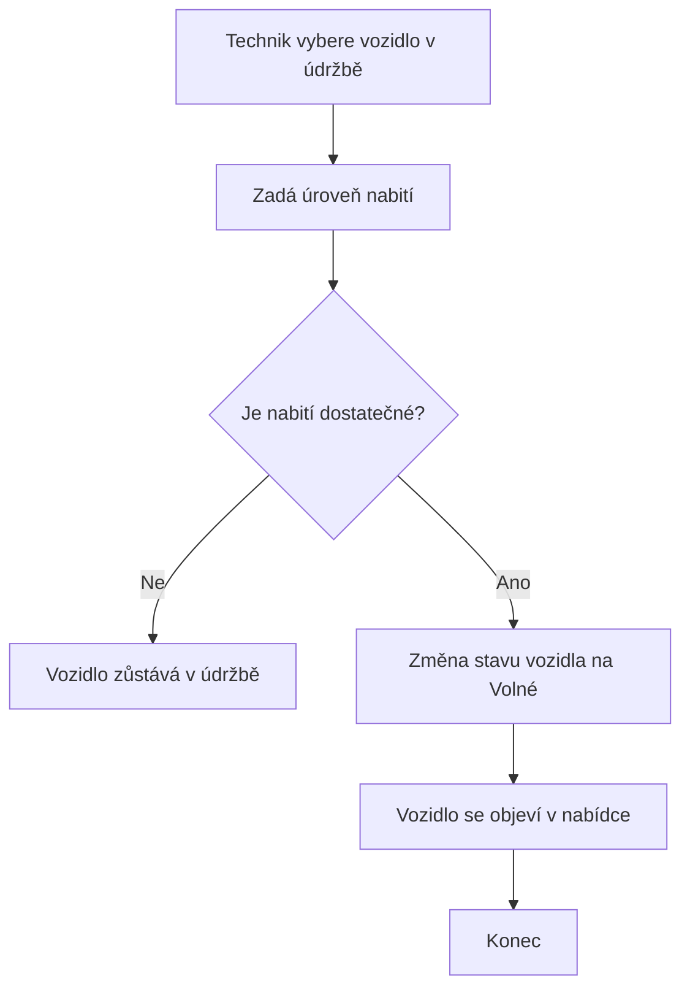

### 1.3.8 Testovací jízda technika (konflikt K3)

Tok je shodný s rezervací a jízdou běžného uživatele (1.3.1) – liší se jen tím,
že se podle role uživatele v okamžiku vytvoření rezervace označí jako testovací
a po ukončení jízdy se přeskočí fakturace.

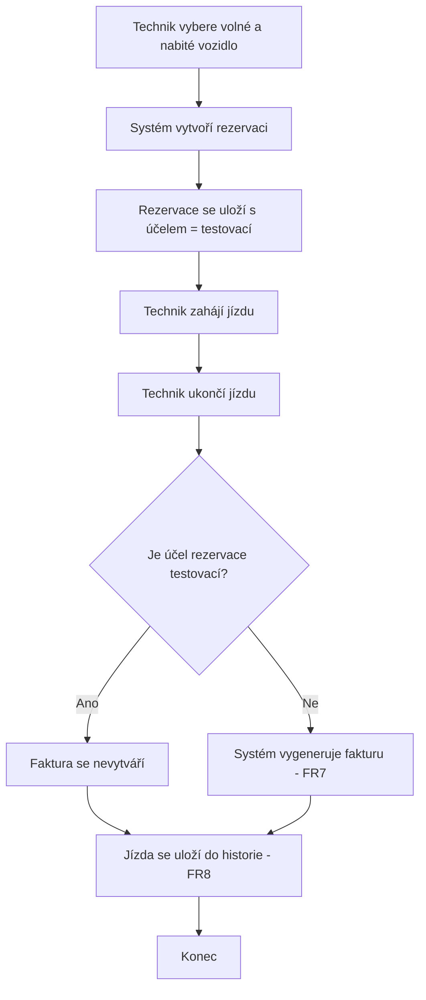

### 1.3.9 Ukončení jízdy - spotřeba baterie a automatický přesun do servisu

Rozšiřuje krok "ukončí jízdu" z diagramů 1.3.1/1.3.8 o dvě navazující pravidla
zavedená dodatečně (feature request - issue #11 - a jeho oprava - bug #14 -,
konflikt K4 - issue #4).

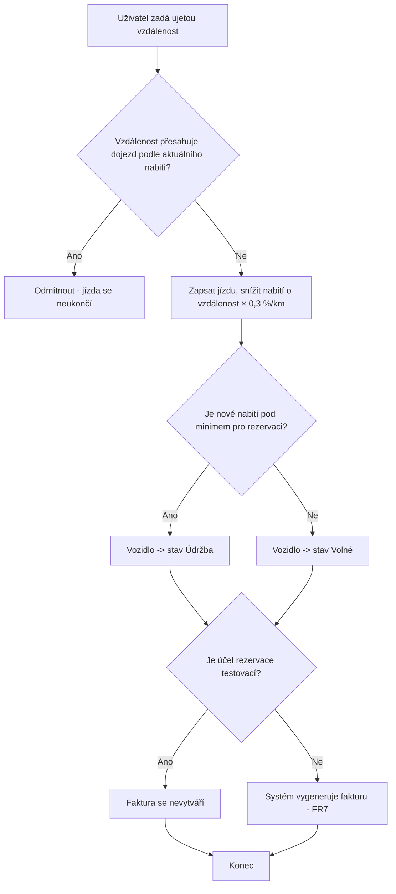

### 1.3.10 Správa flotily (admin)

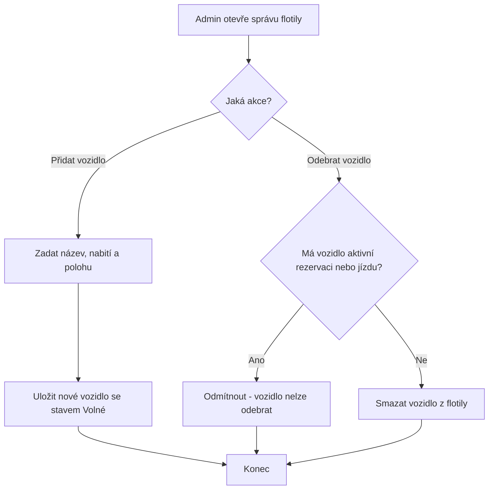

---

## 1.4 Funkční požadavky

Priorita je uvedena podle metody MoSCoW zjednodušené na tři úrovně:
**Vysoká** (musí být), **Střední** (mělo by být), **Nízká** (mohlo by být).

| ID | Požadavek | Priorita | Zdroj | Možná rizika | Závislosti |
|----|-----------|----------|-------|--------------|------------|
| FR1 | Systém umožní registraci a přihlášení uživatele. | Vysoká | Analýza (scénář předpokládá uživatele) | Slabá hesla, zneužití účtu | – |
| FR2 | Systém zobrazí dostupná vozidla na mapě. | Vysoká | Scénář (integrace s mapou) | Výpadek externí mapové služby | FR14 |
| FR3 | Uživatel může rezervovat volné a dostatečně nabité vozidlo. | Vysoká | Scénář (rezervace) | Souběžná rezervace stejného vozidla | FR1, FR14 |
| FR4 | Uživatel může zrušit svou aktivní rezervaci. | Střední | Analýza | Zrušení již ukončené rezervace | FR3 |
| FR5 | Rezervace automaticky vyprší po stanoveném čase, pokud jízda nezačne. | Střední | Analýza (viz konflikt K1) | Nejasná délka platnosti | FR3 |
| FR6 | Uživatel může zahájit a ukončit jízdu z rezervovaného vozidla. | Vysoká | Scénář (historie jízd) | Nekonzistentní stav při chybě | FR3 |
| FR7 | Systém po ukončení jízdy vygeneruje fakturu. | Vysoká | Scénář (fakturace) | Chybný výpočet ceny | FR6 |
| FR7a | Testovací jízda technika (viz K3) se nefakturuje. | Střední | Konflikt K3 | Technik zneužije testovací jízdu k běžnému provozu | FR7, FR12 |
| FR8 | Uživatel může zobrazit historii svých jízd a faktur. | Střední | Scénář (historie jízd) | Únik dat jiného uživatele | FR6, FR7 |
| FR9 | Admin může spravovat uživatele (vytvořit, zablokovat/odblokovat). | Vysoká | Scénář (správa uživatelů) | Náhodné zablokování aktivního uživatele | FR1 |
| FR10 | Admin může měnit role a oprávnění uživatelů. | Vysoká | Scénář (oprávnění) | Eskalace oprávnění | FR9 |
| FR11 | Admin může přidat nebo odebrat vozidlo z flotily. | Střední | Analýza | Odebrání rezervovaného vozidla | FR14 |
| FR12 | Servisní technik může označit vozidlo do údržby. | Vysoká | Scénář (stav vozidel) | Označení právě používaného vozidla | FR14 |
| FR13 | Servisní technik může potvrdit nabití a uvolnit vozidlo. | Střední | Analýza | Uvolnění nedostatečně nabitého vozidla | FR12, FR14 |
| FR14 | Systém sleduje stav každého vozidla (volné / rezervováno / v jízdě / údržba). | Vysoká | Scénář (sledování stavu) | Nekonzistence stavu mezi komponentami | – |
| FR15 | Po ukončení jízdy se nabití vozidla sníží úměrně ujeté vzdálenosti (výchozí 0,3 %/km), nikdy pod 0. | Střední | Feature request (issue #11) | Ujetá vzdálenost mohla přesáhnout fyzicky možný dojezd - nalezeno a opraveno jako bug #14 (kontrola max. dojezdu při ukončení jízdy) | FR6, FR14 |
| FR16 | Pokud po ukončení jízdy klesne nabití vozidla pod minimum pro rezervaci, systém ho automaticky přepne do stavu "údržba". | Vysoká | Konflikt K4 (issue #4) | Vozidlo zbytečně poslané do servisu kvůli chybě v měření/zaokrouhlení | FR13, FR14, FR15 |
| FR17 | Uživatel vidí živý odpočet do vypršení své rezervace. | Nízká | UX vylepšení (issue #16) | Nesoulad časové zóny serveru a prohlížeče (opraveno - časy se posílají v UTC) | FR3, FR5 |
| FR18 | Admin vidí u vozidla ve flotile jméno uživatele, který ho má právě rezervované nebo v jízdě. | Nízká | Feature request (issue #17) | Únik osobních údajů jiného uživatele | FR11, FR14 |
| FR19 | Admin může zobrazit přehled všech faktur všech uživatelů, filtrovatelný podle uživatele a vozidla. | Střední | Součást issue #5 | Únik fakturačních dat | FR7, FR9 |
| FR20 | Systém zobrazuje aktuální verzi frontendu a backendu (footer). | Nízká | Provozní požadavek (issue #21) | – | – |

---

## 1.5 Nefunkční požadavky

| ID | Požadavek | Priorita | Zdroj | Možná rizika | Závislosti |
|----|-----------|----------|-------|--------------|------------|
| NFR1 | Odezva REST API bude do 500 ms u 95 % požadavků. | Střední | Analýza (použitelnost) | Zpomalení při vyšší zátěži | NFR4 |
| NFR2 | Dostupnost systému bude alespoň 99,5 % měsíčně. | Střední | Analýza (provozní požadavek) | Výpadek databáze nebo mapy | – |
| NFR3 | Hesla budou uložena v hashované podobě a přístup bude řízen podle rolí. | Vysoká | Analýza (bezpečnost) | Únik databáze, chybná autorizace | FR1, FR10 |
| NFR4 | Systém zvládne alespoň 500 souběžných uživatelů. | Nízká | Analýza (škálovatelnost) | Nedostatečné zdroje | – |
| NFR5 | Osobní údaje budou zpracovány v souladu s GDPR. | Vysoká | Legislativa | Právní postih při porušení | FR8 |
| NFR6 | Systém bude modulární, aby šel snadno rozšiřovat (viz kap. 6). | Střední | Analýza (udržovatelnost) | Těsná provázanost komponent | – |
| NFR7 | Data systému přežijí restart nebo rebuild nasazení (Docker). | Vysoká | Provozní požadavek (issue #6) | Ztráta dat při špatně nastaveném volume | – |

---

## 1.6 Konfliktní a nejasné požadavky

Během analýzy vzniklo několik nejasností a konfliktů. U každého je uvedeno
navržené řešení.

### K1 – Jak dlouho drží rezervace vozidlo blokované?

**Problém:** Scénář uvádí rezervaci vozidla, ale neříká, jak dlouho zůstane
vozidlo rezervované, pokud uživatel jízdu nezahájí. Dlouhá rezervace blokuje
vozidlo ostatním (konflikt mezi FR3 a dostupností vozidel pro ostatní).

**Řešení:** Zavedeme časový limit platnosti rezervace (30 minut). Po jeho
vypršení se rezervace automaticky zruší a vozidlo se uvolní (požadavek FR5).
Konkrétní hodnota je konfigurovatelná, ale měnit ji smí pouze administrátor.

### K2 – Platí uživatel za dobu rezervace, nebo jen za jízdu?

**Problém:** Není jasné, zda se účtuje čas rezervace (než uživatel dojde
k vozidlu), nebo až samotná jízda. Obchodní pohled (účtovat rezervaci) je
v konfliktu s očekáváním uživatele (platit jen za jízdu).

**Řešení:** V první verzi se účtuje pouze samotná jízda (od zahájení do ukončení).
Rezervace do vypršení limitu je zdarma. Případné poplatky za rezervaci nad limit
jsou ponechány na pozdější iteraci (viz kap. 6).

### K3 – Může servisní technik zároveň rezervovat vozidla jako běžný uživatel?

**Problém:** Role technika není v zadání přesně ohraničená. Není jasné, zda má
i práva běžného uživatele.

**Řešení:** Technik smí kromě označení vozidla do údržby (FR12) vozidlo i
rezervovat – jde o testovací jízdu. Logika rezervace i jízdy je stejná jako
u běžného uživatele (FR3, FR6), ale jízda se mu nefakturuje (viz FR7a).

Účel rezervace ("běžná" / "testovací") se určí podle role uživatele v okamžiku
vytvoření rezervace a uloží se přímo na rezervaci – nejde tedy o odvozování
z aktuální role uživatele až při fakturaci. Díky tomu je rozhodnutí auditovatelné
zpětně v datech a odolné vůči pozdější změně role uživatele. Testovací jízda se
v historii jízd zobrazuje stejně jako běžnému uživateli (FR8).

Autorizace podle role (kdo smí co dělat) je vyřešená stejným vzorem jako
u ostatních rolově omezených akcí v systému - viz K5.

### K4 – Lze rezervovat vozidlo s nízkým stavem nabití?

**Problém:** Konflikt mezi FR3 (rezervace) a provozní bezpečností. Málo nabité
vozidlo by nemuselo dojet do cíle. Otevřenou otázkou bylo i to, *kdy přesně*
se má vozidlo technikovi nabídnout - při vrácení posledním zákazníkem, nebo
až při kontrole před další rezervací?

**Řešení:** Zavedeme minimální úroveň nabití (20 %), pod kterou vozidlo nelze
rezervovat (kontrola je součástí rezervační logiky, FR3). Nabídnutí
technikovi řešíme při vrácení vozidla: pokud po ukončení jízdy klesne nabití
pod tuto hranici, systém vozidlo automaticky přepne do stavu "údržba" (místo
"volné") - není tedy vůbec nabídnuto k další rezervaci s nedostatečným
nabitím a technik ho uvidí ve svém přehledu vozidel k servisu. Servis pak
technik ukončí stejným postupem jako u ručně označeného vozidla (FR13).

### K5 – Jak vyřešit přihlášení a autorizaci, když FR1 počítá s registrací a NFR3 s hashovanými hesly?

**Problém:** FR1 předpokládá registraci a přihlášení, NFR3 hashovaná hesla a
řízení přístupu podle rolí. Skutečná autentizace (hesla, tokeny, session) je
ale nad rámec rozsahu tohoto zápočtového projektu (issue #3).

**Řešení:** Přihlášení je zjednodušené - uživatel se jen vybere ze seznamu
(`GET /uzivatele`), žádné heslo se nezadává. Autorizace jednotlivých akcí
(K1 - správa platnosti rezervace, admin/technik endpointy) se ale řeší
skutečně, jen jinak než heslem: server si podle `uzivatel_id`/`admin_id`/
`technik_id` poslaného v požadavku dohledá uživatele v databázi a ověří jeho
roli, než akci povolí. Neautorizovaný pokus (např. běžný uživatel volající
administrátorský endpoint) server odmítne s HTTP 400.

Tento model je vědomý kompromis - řeší rozlišení rolí uvnitř aplikace, ale
neřeší ověření identity (kdokoliv zná cizí `uzivatel_id`, může se za daného
uživatele "vydávat"). Doplnění skutečné autentizace (hesla/tokeny) zůstává
navrženou budoucí změnou (viz kap. 6).
# 2. Softwarová architektura

## 2.1 Volba architektury

Pro systém byla zvolena **vrstvená architektura (layered / monolitická)**, nikoli
mikroslužby.

### Zdůvodnění

Zvažovány byly dvě varianty:

**Vrstvená architektura (zvolená):**
- Systém je v této fázi malý a spravuje ho jeden tým – monolit je jednodušší na
  vývoj, nasazení i testování.
- Jednotlivé odpovědnosti se dají čistě oddělit do vrstev (prezentace, logika,
  data), takže kód zůstává přehledný a snadno rozšiřitelný (splňuje NFR6).
- Nižší provozní režie – jedna aplikace, jedna databáze, žádná složitá
  komunikace po síti mezi službami.

**Mikroslužby (zamítnuty pro tuto fázi):**
- Přinesly by zbytečnou složitost (síťová komunikace, distribuované transakce,
  více nasazení) pro systém, který zatím nemá velkou zátěž ani velký tým.
- Mají smysl až při růstu (mnoho měst, vysoká zátěž) – proto jsou uvedeny jako
  možná evoluce v kapitole 6.

Vrstvená architektura je zároveň dobrým výchozím bodem: jednotlivé vrstvy a
komponenty jsou navrženy tak, aby z nich šlo v budoucnu vyčlenit samostatné
služby, pokud to bude potřeba.

Volba se potvrdila i v praxi: když k systému přibyl webový frontend, nevyžádal
si žádnou změnu rezervační služby ani datové vrstvy - jde jen o dalšího
klienta REST API, stejně jako `curl` nebo konzolová ukázka.

## 2.2 Vrstvy systému

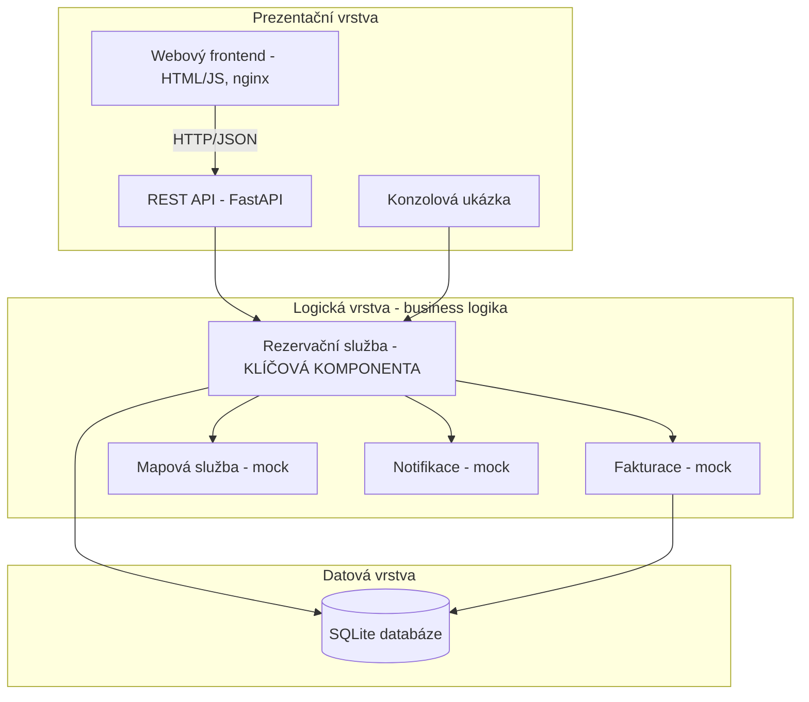

- **Prezentační vrstva** – přijímá požadavky zvenčí. Obsahuje REST API (FastAPI)
  pro webové volání, webový frontend (statické HTML/JS servírované přes nginx,
  komunikuje s API jen přes HTTP/JSON) a konzolovou ukázku, která demonstruje
  komunikaci komponent přímo přes rezervační službu.
- **Logická vrstva** – jádro systému. Obsahuje rezervační službu (klíčová
  komponenta) a pomocné služby fakturace, mapy a notifikací (v této fázi mocky).
- **Datová vrstva** – SQLite databáze, přístup přes jednoduchý modul `database.py`.

## 2.3 Diagram komponent a interakce

Následující diagram ukazuje hlavní komponenty a to, jak spolu komunikují při
rezervaci a jízdě. Podle zadání nejde o striktní UML.

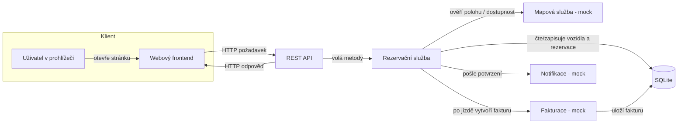

### Popis interakcí

1. **Uživatel → Frontend → REST API** – uživatel klikne v prohlížeči (např.
   "rezervovat vozidlo"), frontend z toho sestaví HTTP požadavek na API. Stejně
   se dá API volat i přímo (curl/Postman) - frontend v tom nemá žádné výsadní
   postavení, je to jen další klient.
2. **REST API → Rezervační služba** – API zavolá odpovídající metodu služby.
   Samo neobsahuje business logiku, jen převádí HTTP na volání služby.
3. **Rezervační služba → Databáze** – služba načte stav vozidla a uživatele,
   ověří podmínky (volné vozidlo, dostatečné nabití, neblokovaný uživatel) a
   uloží novou rezervaci.
4. **Rezervační služba → Mapová služba** – ověří / doplní informace o poloze
   vozidla (v této fázi mock, který vrací připravená data).
5. **Rezervační služba → Fakturace** – po ukončení jízdy si vyžádá vytvoření
   faktury; fakturace spočítá cenu a uloží ji.
6. **Rezervační služba → Notifikace** – odešle uživateli potvrzení (mock tiskne
   na stdout).
7. **REST API → Frontend** – vrátí výsledek operace (např. ID rezervace nebo
   chybu); frontend ho promítne do UI.

## 2.4 Mapování komponent na soubory

Aby report a kód na sebe navazovaly, každá komponenta odpovídá jednomu souboru:

| Komponenta | Soubor | Odpovědnost |
|------------|--------|-------------|
| Datová vrstva | `src/database.py` | Vytvoření tabulek a přístup k datům (SQLite) |
| Rezervační služba (klíčová) | `src/reservation_service.py` | Rezervace, kontroly stavu, jízdy |
| Fakturace (mock) | `src/billing.py` | Výpočet a uložení faktury |
| Mapová služba (mock) | `src/maps.py` | Poloha a dostupnost vozidel |
| Notifikace (mock) | `src/notifications.py` | Odeslání zpráv uživateli |
| Konzolová ukázka | `src/console_demo.py` | Demonstrace komunikace komponent |
| REST API | `src/main.py` | HTTP rozhraní nad rezervační službou |
| Webový frontend | `frontend/index.html`, `frontend/app.html`, `frontend/js/*.js` | Statické UI (přihlášení, rezervace, admin/technik panely) nad REST API, žádný build krok |

## 2.5 Nasazení (Docker)

Systém se dá spustit i přes `docker-compose.yml` v kořeni repozitáře - dvě
samostatné služby, každá s vlastním Dockerfile:

- **`api`** (`src/Dockerfile`) – Python/uvicorn, databáze žije v adresáři
  `/app/data` odděleném od kódu (`/app/src`), na který je připojený
  pojmenovaný Docker volume (`api_data`). Díky tomu data přežijí
  `docker compose down` i `--build` (NFR7) a zároveň rebuild image s novým
  kódem volume nezastíní.
- **`frontend`** (`frontend/Dockerfile`) – nginx servírující statické soubory.
  Adresa API se do frontendu propisuje za běhu kontejneru přes proměnnou
  prostředí `API_BASE_URL` (`docker-entrypoint.sh` přegeneruje `js/config.js`).
  nginx zároveň posílá `Cache-Control: no-store` pro všechny statické soubory
  - bez toho hrozilo, že prohlížeč drží starou verzi JS proti nové verzi HTML
  (a naopak) po každém update frontendu.

Obě služby lze verzovat nezávisle (viz `GET /verze` a `frontend/js/verze.js`,
NFR/FR20) - odpovídá tomu, že jde o dva samostatně nasaditelné artefakty.
# 3. Implementace komponenty a 4. Webové služby

## 3.1 Implementovaná komponenta

Klíčovou implementovanou komponentou je **rezervační služba**
(`src/reservation_service.py`), třída `RezervacniSluzba`. Zapouzdřuje business
logiku systému a je napojena na datovou vrstvu i na ostatní komponenty.

Hlavní metody a jejich kontroly, podle oblasti:

**Rezervace a jízda (FR3–FR8, FR15–FR17)**

| Metoda | Co dělá | Kontroly |
|--------|---------|----------|
| `zobraz_dostupna_vozidla()` | Vrátí volná vozidla, uklidí vypršelé rezervace (K1), předá vozidla mapě | – |
| `vytvor_rezervaci(uzivatel_id, vozidlo_id)` | Vytvoří rezervaci, vrátí i `platnost_do` (FR17 - countdown) | uživatel existuje a není zablokovaný, vozidlo je volné, nabití ≥ 20 % (K4) |
| `zrus_rezervaci(rezervace_id)` | Zruší rezervaci a uvolní vozidlo | rezervace je aktivní |
| `zahaj_jizdu(rezervace_id)` | Zahájí jízdu | rezervace je aktivní a nevypršela (K1) |
| `ukonci_jizdu(jizda_id, ujeto_km)` | Ukončí jízdu, sníží nabití (FR15), případně přepne vozidlo do údržby (FR16) a vytvoří fakturu (přeskočí se pro testovací jízdu, FR7a) | jízda ještě neskončila, `ujeto_km` nepřesahuje reálný dojezd podle aktuálního nabití (bugfix #14) |
| `historie_jizd(uzivatel_id)` | Vrátí jízdy uživatele, včetně účelu (běžná/testovací) | – |

**Platnost rezervace (K1, admin)**

| Metoda | Co dělá | Kontroly |
|--------|---------|----------|
| `ziskej_platnost_rezervace_minut()` | Vrátí aktuální limit (výchozí 30 min) | – |
| `nastav_platnost_rezervace(uzivatel_id, minuty)` | Změní limit platnosti rezervace | volající má roli `admin` |
| `over_a_vyprsele_rezervace()` | Interní - zruší vypršelé rezervace a uvolní jejich vozidla | – |

**Admin - uživatelé, flotila, faktury (FR9–FR11, FR18, FR19)**

| Metoda | Co dělá | Kontroly |
|--------|---------|----------|
| `vytvor_uzivatele(admin_id, jmeno, role)` | Vytvoří nového uživatele | volající má roli `admin`, role je platná |
| `nastav_zablokovani_uzivatele(admin_id, cilovy_uzivatel_id, zablokovan)` | (Od)blokuje uživatele | volající má roli `admin` |
| `zmen_roli_uzivatele(admin_id, cilovy_uzivatel_id, nova_role)` | Změní roli uživatele | volající má roli `admin`, role je platná |
| `pridej_vozidlo(admin_id, nazev, nabiti, lat, lon)` | Přidá vozidlo do flotily se stavem "volné" | volající má roli `admin` |
| `odeber_vozidlo(admin_id, vozidlo_id)` | Odebere vozidlo z flotily | volající má roli `admin`, vozidlo nemá aktivní rezervaci/jízdu |
| `vsechna_vozidla(uzivatel_id)` | Vrátí všechna vozidla (i mimo "volné"), s jménem aktivního uživatele u rezervovaných/v jízdě (FR18) | volající má roli `admin` nebo `technik` |
| `vsechny_faktury(admin_id, vozidlo_id=None, uzivatel_id=None)` | Přehled všech faktur, volitelně filtrovaný podle vozidla/uživatele (FR19) | volající má roli `admin` |

**Technik - servis vozidla (FR12, FR13)**

| Metoda | Co dělá | Kontroly |
|--------|---------|----------|
| `oznac_vozidlo_pro_udrzbu(technik_id, vozidlo_id)` | Přepne vozidlo do stavu "údržba" | volající má roli `technik`, vozidlo je "volné" |
| `ukonci_servis(technik_id, vozidlo_id, nabiti)` | Zapíše nové nabití; uvolní vozidlo, jen pokud je nabití ≥ 20 % - jinak zůstává v údržbě | volající má roli `technik`, vozidlo je "v údržbě" |

Každá metoda vrací slovník `{"ok": ..., "zprava": ...}` (případně s dalšími
údaji jako `rezervace_id` nebo seznamem výsledků), takže výsledek se dá stejně
použít v konzoli i v REST API. Metody vázané na roli (admin/technik) neověřují
identitu volajícího heslem, ale dohledáním role podle poslaného ID - viz K5
v kapitole 1.

## 3.2 Komunikace s ostatními komponentami

Rezervační služba komunikuje s dalšími částmi systému. Ostatní komponenty jsou
v této fázi mocky, které tisknou na standardní výstup, takže je komunikace vidět.

Výstup konzolové ukázky (`src/console_demo.py`) při rezervaci a jízdě:

```
[MAPA] Zobrazuji dostupna vozidla na mape:
   - Auto A na pozici 50.08 14.42 (nabiti 80 %)
   - Auto B na pozici 50.09 14.43 (nabiti 15 %)
[MAPA] Overuji polohu vozidla Auto A
[NOTIFIKACE] Uzivatel c. 1 -> Vase rezervace vozidla byla vytvorena.
...
[FAKTURACE] Vytvarim fakturu za jizdu c. 1 - ujeto 12 km, castka 60.0 Kc
[NOTIFIKACE] Uzivatel c. 1 -> Vase jizda byla ukoncena a vyuctovana.
```

Z výstupu je vidět, že rezervační služba postupně volá **mapovou službu**
(zobrazení a ověření polohy), **notifikace** (potvrzení uživateli) a
**fakturaci** (vytvoření faktury po jízdě). Také je vidět kontrola z konfliktu
K4 – vozidlo s nízkým nabitím (Auto B) systém odmítne rezervovat.

## 4.1 REST API

Nad rezervační službou je jednoduché REST API (`src/main.py`, FastAPI).
Endpointy jen převádějí HTTP požadavky na volání služby.

| Metoda a cesta | Popis | Tělo požadavku |
|----------------|-------|----------------|
| `GET /verze` | Verze backendu (footer frontendu, FR20) | – |
| `GET /uzivatele` | Seznam všech uživatelů (přihlašovací obrazovka) | – |
| `GET /vozidla` | Seznam dostupných (volných) vozidel | – |
| `POST /rezervace` | Vytvoří rezervaci | `{"uzivatel_id": 1, "vozidlo_id": 1}` |
| `POST /rezervace/{id}/zruseni` | Zruší rezervaci | – |
| `POST /jizdy` | Zahájí jízdu | `{"rezervace_id": 1}` |
| `POST /jizdy/{id}/ukonceni` | Ukončí jízdu, sníží baterii, případně vyfakturuje | `{"ujeto_km": 8}` |
| `POST /nastaveni/platnost-rezervace` | Změní limit platnosti rezervace (K1, jen admin) | `{"uzivatel_id": 2, "minuty": 45}` |
| `GET /uzivatele/{id}/historie` | Historie jízd uživatele (vč. účelu) | – |
| `POST /admin/uzivatele` | Vytvoří uživatele (jen admin) | `{"admin_id": 2, "jmeno": "...", "role": "uzivatel"}` |
| `POST /admin/uzivatele/{id}/zablokovani` | (Od)blokuje uživatele (jen admin) | `{"admin_id": 2, "zablokovan": true}` |
| `POST /admin/uzivatele/{id}/role` | Změní roli uživatele (jen admin) | `{"admin_id": 2, "role": "technik"}` |
| `POST /admin/vozidla` | Přidá vozidlo do flotily (jen admin) | `{"admin_id": 2, "nazev": "...", "nabiti": 100, "lat": 50.08, "lon": 14.42}` |
| `POST /admin/vozidla/{id}/odebrani` | Odebere vozidlo z flotily (jen admin) | `{"admin_id": 2}` |
| `GET /vozidla/vsechna` | Všechna vozidla vč. stavu a aktivního uživatele (admin/technik) | – (`uzivatel_id` jako query parametr) |
| `GET /admin/faktury` | Přehled všech faktur, filtrovatelný (jen admin) | – (`admin_id`, volitelně `vozidlo_id`/`uzivatel_id` jako query parametry) |
| `POST /vozidla/{id}/udrzba` | Označí vozidlo do servisu (jen technik) | `{"technik_id": 3}` |
| `POST /vozidla/{id}/ukonceni-servisu` | Ukončí servis, zapíše nabití (jen technik) | `{"technik_id": 3, "nabiti": 90}` |

Chybové stavy (např. málo nabité vozidlo, chybějící oprávnění) vrací HTTP kód
**400** s popisem chyby. FastAPI navíc automaticky vytvoří interaktivní
dokumentaci na `/docs`, kde je vidět i verze API (`GET /verze` /
`app = FastAPI(version=...)`).

Spuštění serveru (ve složce `src`):

```
uvicorn main:app --reload
```

Alternativně celý systém (API + frontend) přes `docker compose up --build` v
kořeni repozitáře - viz kapitola 2.5.

## 4.2 Ukázka volání (curl)

Následující volání byla skutečně spuštěna proti běžícímu API. Skript je také
v souboru `curl_ukazky.sh`.

```
### 1) GET /vozidla
[{"id":1,"nazev":"Auto A","nabiti":80,"lat":50.08,"lon":14.42},
 {"id":2,"nazev":"Auto B","nabiti":15,"lat":50.09,"lon":14.43}]

### 2) POST /rezervace  -d '{"uzivatel_id":1,"vozidlo_id":1}'
{"ok":true,"zprava":"Rezervace vytvorena.","rezervace_id":1}

### 3) POST /jizdy  -d '{"rezervace_id":1}'
{"ok":true,"zprava":"Jizda zahajena.","jizda_id":1}

### 4) POST /jizdy/1/ukonceni  -d '{"ujeto_km":8}'
{"ok":true,"zprava":"Jizda ukoncena.","faktura_id":1}

### 5) GET /uzivatele/1/historie
[{"jizda_id":1,"vozidlo_id":1,"ujeto_km":8.0,
  "cas_start":"...","cas_konec":"..."}]

### 6) POST /rezervace  -d '{"uzivatel_id":1,"vozidlo_id":2}'   (nizke nabiti)
{"detail":"Vozidlo ma prilis nizke nabiti."}     [HTTP 400]

### 7) GET /verze
{"verze":"0.1.0"}

### 8) POST /admin/uzivatele  -d '{"admin_id":2,"jmeno":"Nova Novakova","role":"uzivatel"}'
{"ok":true,"zprava":"Uzivatel vytvoren.","uzivatel_id":4}

### 9) POST /vozidla/1/udrzba  -d '{"technik_id":3}'
{"ok":true,"zprava":"Vozidlo bylo oznaceno do servisu."}

### 10) POST /vozidla/1/udrzba  -d '{"technik_id":1}'   (bezny uzivatel, ne technik)
{"detail":"Pouze technik muze oznacit vozidlo do servisu."}     [HTTP 400]
```

Volání 6 ukazuje, že se pravidlo o minimálním nabití (konflikt K4) uplatní i
přes REST API, nejen v rezervační službě samotné. Volání 10 ukazuje totéž pro
autorizaci podle role (K5) - technikovská akce zavolaná s ID běžného
uživatele se odmítne.
# 5. Testování softwaru

## 5.1 Implementované testy

Pro rezervační komponentu je napsáno 35 testů (`src/test_reservation.py`),
jednotkových i integračních. Všechny procházejí (`35 passed`).

**Základní rezervace a jízda**

| Test | Typ | Co ověřuje |
|------|-----|------------|
| `test_rezervace_uspesna` | jednotkový | Úspěšná rezervace, vozidlo přejde do stavu „rezervováno" |
| `test_rezervace_vraci_platnost_do_pro_countdown` | jednotkový | Odpověď obsahuje `platnost_do` pro countdown (FR17) |
| `test_rezervace_malo_nabiteho_vozidla` | jednotkový | Odmítnutí vozidla pod 20 % nabití (K4) |
| `test_rezervace_neexistujiciho_vozidla` | jednotkový | Ošetření neexistujícího vozidla |
| `test_rezervace_zablokovaneho_uzivatele` | jednotkový | Zablokovaný uživatel nemůže rezervovat |
| `test_zruseni_rezervace_uvolni_vozidlo` | jednotkový | Po zrušení je vozidlo zase volné |

**Platnost rezervace (K1)**

| Test | Typ | Co ověřuje |
|------|-----|------------|
| `test_vychozi_platnost_rezervace_je_30_minut` | jednotkový | Výchozí limit 30 minut |
| `test_admin_muze_zmenit_platnost_rezervace` | jednotkový | Admin může změnit limit |
| `test_bezny_uzivatel_nemuze_zmenit_platnost_rezervace` | jednotkový | Běžný uživatel nemůže změnit limit |
| `test_nova_rezervace_pouziva_zmeneny_limit` | jednotkový | Nová rezervace použije aktuální limit |
| `test_vyprsela_rezervace_uvolni_vozidlo_bez_zahajeni_jizdy` | jednotkový | Vypršelá rezervace se uklidí i bez pokusu o jízdu |
| `test_zahajeni_jizdy_po_vyprseni_rezervace` | jednotkový | Vypršelá rezervace nedovolí jízdu |

**Testovací jízda technika (K3)**

| Test | Typ | Co ověřuje |
|------|-----|------------|
| `test_rezervace_technika_je_testovaci` | jednotkový | Rezervace technika se uloží s účelem "testovací" |
| `test_rezervace_bezneho_uzivatele_je_bezna` | jednotkový | Rezervace běžného uživatele je "běžná" |
| `test_testovaci_jizda_technika_negeneruje_fakturu` | jednotkový | Testovací jízda nevytvoří fakturu, ale je v historii |

**Admin - uživatelé, flotila, faktury**

| Test | Typ | Co ověřuje |
|------|-----|------------|
| `test_admin_muze_vytvorit_uzivatele` | jednotkový | Admin vytvoří uživatele |
| `test_bezny_uzivatel_nemuze_vytvorit_uzivatele` | jednotkový | Neautorizovaný pokus je odmítnut (K5) |
| `test_admin_muze_zablokovat_a_odblokovat_uzivatele` | jednotkový | (Od)blokování uživatele |
| `test_admin_muze_zmenit_roli_uzivatele` | jednotkový | Změna role uživatele |
| `test_admin_muze_pridat_a_odebrat_vozidlo` | jednotkový | Přidání a odebrání vozidla z flotily |
| `test_nelze_odebrat_vozidlo_s_aktivni_rezervaci` | jednotkový | Odebrání vozidla s aktivní rezervací je odmítnuto |
| `test_admin_vidi_aktivniho_uzivatele_rezervovaneho_vozidla` | jednotkový | Admin vidí jméno u rezervovaného vozidla (FR18) |
| `test_volne_vozidlo_nema_aktivniho_uzivatele` | jednotkový | U volného vozidla je aktivní uživatel `None` |
| `test_admin_vidi_vsechny_faktury` | jednotkový | Přehled faktur všech uživatelů (FR19) |
| `test_admin_muze_filtrovat_faktury_podle_vozidla_a_uzivatele` | jednotkový | Filtrování faktur podle vozidla/uživatele |

**Servis vozidla, baterie (K4)**

| Test | Typ | Co ověřuje |
|------|-----|------------|
| `test_technik_muze_oznacit_a_ukoncit_servis` | jednotkový | Technik označí vozidlo do servisu a ukončí ho |
| `test_ukonceni_servisu_s_nizkym_nabitim_necha_vozidlo_v_udrzbe` | jednotkový | Nedostatečné nabití po servisu nechá vozidlo v údržbě |
| `test_bezny_uzivatel_nemuze_oznacit_vozidlo_do_servisu` | jednotkový | Neautorizovaný pokus je odmítnut (K5) |
| `test_ukonceni_jizdy_snizi_nabiti_podle_ujete_vzdalenosti` | jednotkový | Nabití klesne o `ujeto_km × 0,3 %` (FR15) |
| `test_ukonceni_jizdy_nesnizi_nabiti_pod_nulu` | jednotkový | Nabití nikdy neklesne pod 0 |
| `test_vozidlo_jde_automaticky_do_servisu_pri_nizkem_nabiti_po_jizde` | jednotkový | Nízké nabití po jízdě → automatická údržba (FR16) |
| `test_vozidlo_zustava_volne_kdyz_nabiti_neklesne_pod_minimum` | jednotkový | Hraniční hodnota (přesně 20 %) zůstává "volné" |
| `test_ukonceni_jizdy_odmitne_vzdalenost_nad_dojezd_vozidla` | jednotkový | Jízda nad reálný dojezd je odmítnuta (bugfix #14) |

**Integrační testy**

| Test | Typ | Co ověřuje |
|------|-----|------------|
| `test_cely_tok_rezervace_az_faktura` | integrační | Celý tok rezervace → jízda → faktura, kontrola částky |
| `test_api_rezervace_pres_endpoint` | integrační | REST API přes TestClient (`/vozidla`, `/rezervace`, `/verze`, `/uzivatele`) |

Testy používají databázi v paměti (`:memory:`), takže jsou rychlé, nezávislé na
sobě a nemění reálná data. API test si na začátku vytvoří čistou databázi.

## 5.2 Plán testování celého systému

### 5.2.1 Typy testů

- **Jednotkové testy** – testují jednotlivé funkce a metody v izolaci (např.
  kontroly v rezervační službě). Rychlé, pouštějí se při každé změně kódu.
- **Integrační testy** – testují spolupráci komponent (rezervační služba +
  databáze + fakturace + API). Odhalí chyby v rozhraních mezi komponentami.
- **End-to-end (E2E) testy** – testují celý systém z pohledu uživatele, od HTTP
  požadavku po zápis do databáze. U webového API se dají realizovat voláním
  reálných endpointů (např. přes nástroj jako Postman nebo automatizovaně).
- **Akceptační testování** – ověřuje, že systém splňuje požadavky zadavatele.
  Vychází z funkčních požadavků (kap. 1.4), např. „uživatel dokáže rezervovat a
  odjet vozidlem". Provádí se se zadavatelem před nasazením.

### 5.2.2 Metody návrhu testů

- **Blackbox (černá skříňka)** – testy se navrhují jen podle vstupů a
  očekávaných výstupů, bez znalosti vnitřní implementace. Vhodné pro akceptační
  a API testy. Používá se např. testování hraničních hodnot (nabití přesně
  19 %, 20 %, 21 %) a rozdělení do tříd ekvivalence.
- **Whitebox (bílá skříňka)** – testy vycházejí ze znalosti kódu a snaží se
  projít všechny větve. Např. u metody `vytvor_rezervaci` pokrýt každou
  podmínku (neexistující uživatel, zablokovaný uživatel, obsazené vozidlo,
  nízké nabití, úspěch). Měří se pokrytí kódu (code coverage).

### 5.2.3 Další techniky zajištění kvality

- **Statická analýza** – nástroje jako `flake8`, `pylint` nebo `mypy` (kontrola
  typů) odhalí chyby a nekonzistence bez spuštění kódu. Zařazují se do CI.
- **CI/CD datovod (pipeline)** – při každém pushnutí do repozitáře se
  automaticky spustí statická analýza a testy. Pokud projdou, kód se může
  automaticky nasadit (např. GitHub Actions, GitLab CI). Zabraňuje tomu, aby se
  do hlavní větve dostal nefunkční kód.
- **Strategie shift-left** – testování a kontrola kvality se posouvají co
  nejdříve do vývoje (psaní testů spolu s kódem, kontrola už při psaní), místo
  aby se testovalo až na konci. Chyby se tak odhalí dříve a levněji.
- **Code review** – změny prochází revizí druhého vývojáře před sloučením.

### 5.2.4 Návrh testovací pyramidy pro tento systém

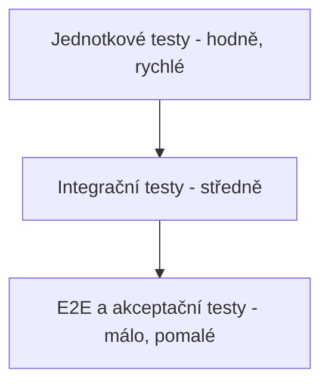

Základ tvoří velké množství rychlých jednotkových testů, nad nimi méně
integračních a nahoře jen několik E2E a akceptačních testů. Tím se udrží rychlá
zpětná vazba a zároveň jistota, že systém funguje jako celek.
# 6. Evoluce softwaru

V další iteraci vývoje bude potřeba systém rozšířit. Níže jsou čtyři navržené
změny a jejich dopad na architekturu a na implementovanou rezervační komponentu.

Klíčové zjištění: díky zvolené **vrstvené architektuře** a tomu, že ostatní části
(fakturace, mapa, notifikace) jsou volané přes jasně dané rozhraní, se u většiny
změn **rezervační služba téměř nemění** – vyměňují se hlavně mock komponenty za
reálné implementace.

## 6.1 Změna 1 – Nový typ uživatele: firemní správce

**Popis:** Přibude role „firemní správce", který spravuje více zaměstnaneckých
účtů pod jednou firmou a vidí souhrnnou fakturaci za všechny své zaměstnance.

**Dopad na architekturu:**
- Do modelu uživatelů přibude vazba „firma" a nová role.
- Fakturace musí umět seskupit jízdy více uživatelů pod jednu firemní fakturu.

**Dopad na kód:**
- V `database.py` přibude tabulka `firmy` a sloupec `firma_id` u uživatelů.
- V rezervační službě se rozšíří kontrola oprávnění (nová role), ale samotná
  logika rezervace zůstává stejná.
- Nejvíc práce je ve fakturační komponentě (souhrnná faktura), ne v jádru.

**Náročnost:** střední.

## 6.2 Změna 2 – Integrace s reálnou platební bránou

**Popis:** Mock fakturace (`billing.py`) se nahradí napojením na reálnou platební
bránu (např. Stripe, GoPay), která provede skutečnou platbu.

**Dopad na architekturu:**
- Fakturace se stane skutečnou externí integrací – přibude síťová komunikace,
  potvrzování plateb a ošetření chyb (platba se nemusí povést).
- Vhodné je zpracovat platbu asynchronně a stav platby ukládat.

**Dopad na kód:**
- Změní se pouze `billing.py` – funkce `vytvor_fakturu` zůstane navenek stejná
  (stejné parametry), jen uvnitř zavolá platební bránu.
- **Rezervační služba se nemění vůbec**, protože fakturaci volá přes stejné
  rozhraní. To je hlavní výhoda oddělení komponent.

**Náročnost:** střední (hlavně kvůli ošetření chyb a bezpečnosti plateb).

## 6.3 Změna 3 – Integrace s reálnou mapovou službou

**Popis:** Mock mapy (`maps.py`) se nahradí reálnou mapovou službou (např.
Mapy.cz nebo Google Maps API), včetně vyhledání nejbližšího vozidla podle polohy
uživatele.

**Dopad na architekturu:**
- Mapová služba se stane externí integrací (NFR – riziko výpadku, nutnost
  ošetřit nedostupnost, případně cache).
- Přibude funkce „najdi nejbližší vozidlo", která potřebuje polohu uživatele.

**Dopad na kód:**
- Změní se `maps.py` – funkce `zobraz_na_mape` a `over_dostupnost` získají reálnou
  implementaci. Přibude nová funkce pro nejbližší vozidlo.
- V rezervační službě lze přidat nepovinný krok „doporuč nejbližší vozidlo", ale
  stávající metody se nemusí měnit.

**Náročnost:** střední.

## 6.4 Změna 4 – Skutečná autentizace (hesla/tokeny)

**Popis:** Zjednodušené přihlášení (K5 - výběr uživatele bez hesla) se nahradí
skutečnou autentizací - hesla (hashovaná, NFR3), přihlašovací tokeny/session a
ověření identity volajícího na úrovni REST API, ne jen role podle poslaného ID.

**Dopad na architekturu:**
- Přibude ověřování požadavků (middleware/dependency ve FastAPI), který token
  ověří a teprve pak předá požadavek endpointu.
- Frontend potřebuje uchovávat token místo prostého záznamu o vybraném
  uživateli (`localStorage`).

**Dopad na kód:**
- V `database.py` přibude sloupec s hashem hesla u uživatele.
- V `main.py` přibude přihlašovací endpoint a ověřovací vrstva.
- **Rezervační služba se nemění vůbec** - kontroly rolí (`_ma_roli` a
  podobné) už dnes pracují s `uzivatel_id` nezávisle na tom, jak byla
  identita ověřena; jen se zpřísní to, odkud se `uzivatel_id` bere (z
  ověřeného tokenu, ne přímo z těla požadavku).

**Náročnost:** střední (hlavně bezpečnostní aspekty - úložiště hesel, expirace
tokenů, ochrana proti zneužití).

## 6.5 Shrnutí dopadů

| Změna | Hlavní zásah | Rezervační služba | Náročnost |
|-------|--------------|-------------------|-----------|
| Firemní správce | databáze + fakturace | malá úprava (oprávnění) | střední |
| Platební brána | billing.py | beze změny | střední |
| Reálná mapa | maps.py | volitelné rozšíření | střední |
| Skutečná autentizace | main.py + databáze | beze změny | střední |

Žádná ze změn nevyžaduje přepsání jádra systému. To potvrzuje, že vrstvená
architektura s oddělenými komponentami byla pro tento systém dobrá volba a
usnadňuje budoucí rozvoj. Při výrazném růstu (mnoho měst, vysoká zátěž) by dalším
krokem mohl být postupný přechod vybraných komponent (fakturace, mapa) na
samostatné **mikroslužby** – architektura je na to připravena.
