# 1. Inženýrství požadavků

## 1.1 Přehled systému

Systém slouží ke správě sdílených elektromobilů ve městě. Umožňuje uživatelům
rezervovat vozidla, sledovat jejich stav, generovat faktury za jízdy, spravovat
uživatele a jejich oprávnění a zobrazovat dostupná vozidla na mapě.

Z analýzy scénáře vyplynuly tři hlavní role uživatelů:

- **Běžný uživatel** – zákazník, který si rezervuje a řídí vozidla.
- **Admin** – správce systému, který spravuje uživatele, oprávnění a flotilu.
- **Servisní technik** – pracovník, který se stará o technický stav vozidel
  (nabíjení, údržba, závady).

---

## 1.2 Role a jejich případy užití

### 1.2.1 Běžný uživatel

Případy užití:
1. Registrace a přihlášení
2. Zobrazit dostupná vozidla na mapě
3. Rezervovat vozidlo
4. Zrušit rezervaci
5. Zobrazit historii jízd a faktur

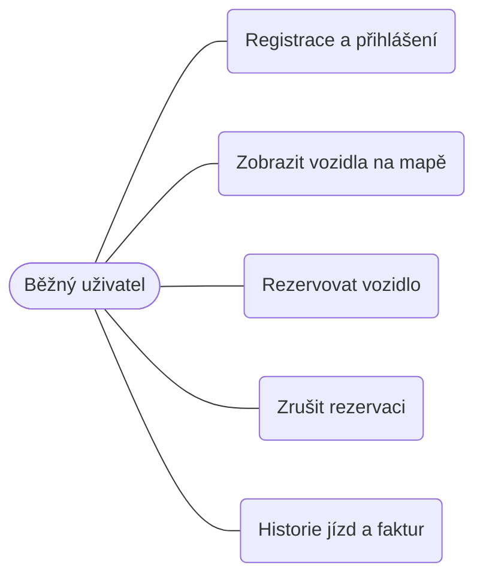

### 1.2.2 Admin

Případy užití:
1. Spravovat uživatele (vytvořit, upravit, zablokovat)
2. Spravovat oprávnění (přiřadit roli)
3. Spravovat flotilu (přidat / odebrat vozidlo)
4. Zobrazit přehled a statistiky provozu

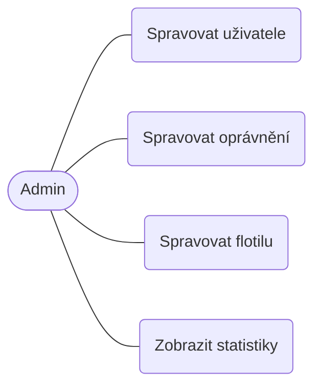

### 1.2.3 Servisní technik

Případy užití:
1. Označit vozidlo do údržby
2. Potvrdit nabití vozidla
3. Nahlásit závadu
4. Zobrazit vozidla vyžadující servis
5. Rezervovat vozidlo pro testovací jízdu (viz konflikt K3)

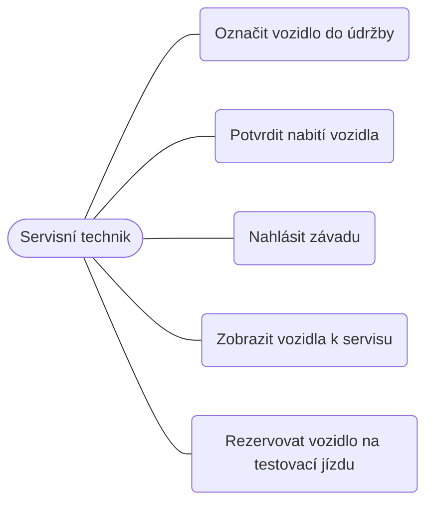

### 1.2.4 Souhrnný pohled na systém

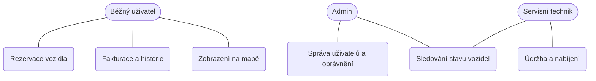

---

## 1.3 Diagramy aktivit

Diagramy aktivit popisují průběh vybraných klíčových případů užití. Podle zadání
nejsou příliš podrobné – zachycují hlavní kroky a rozhodnutí.

### 1.3.1 Rezervace vozidla (běžný uživatel) – klíčový tok

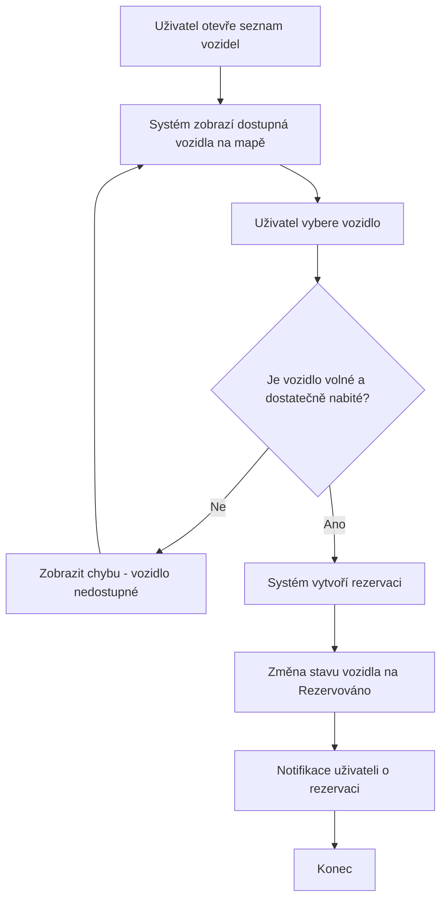

### 1.3.2 Zrušení rezervace (běžný uživatel)

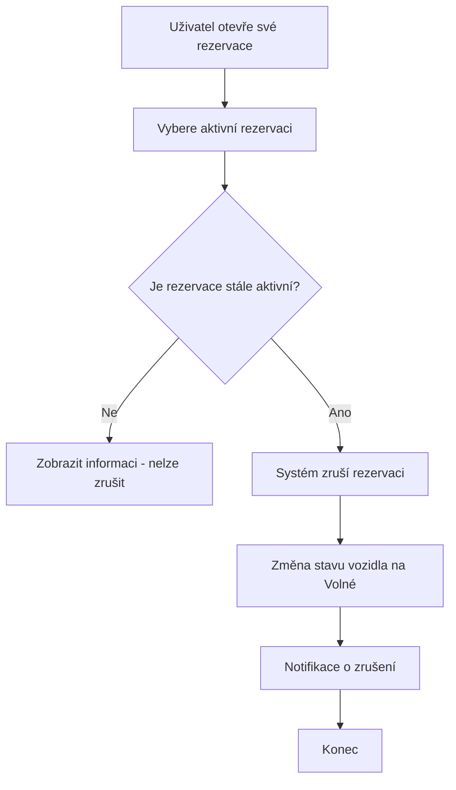

### 1.3.3 Zobrazení historie jízd a faktur (běžný uživatel)

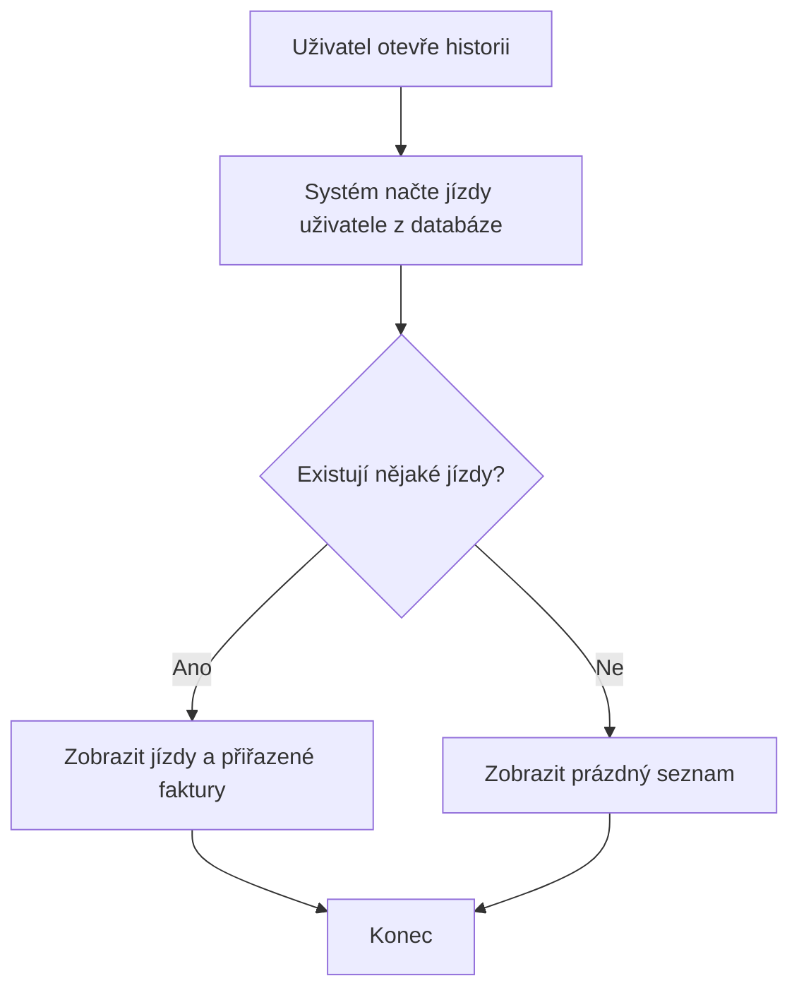

### 1.3.4 Správa uživatelů (admin)

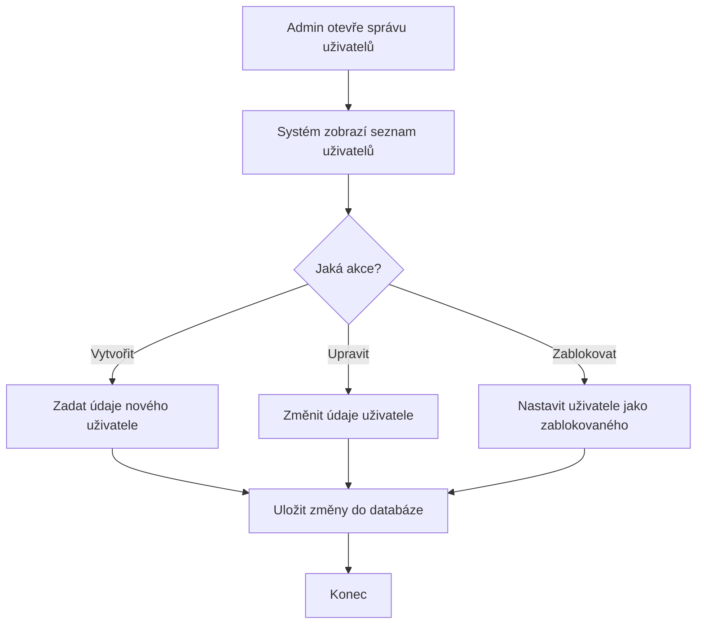

### 1.3.5 Správa oprávnění (admin)

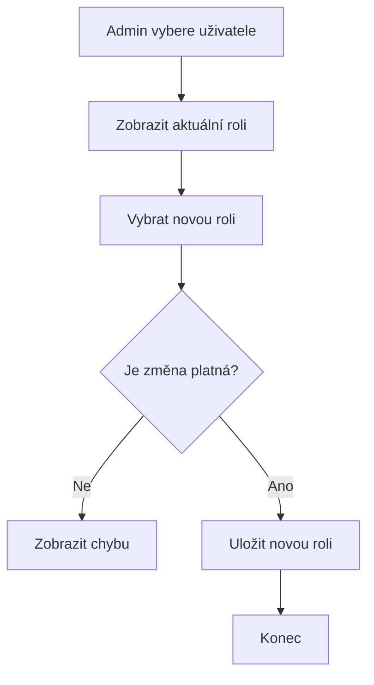

### 1.3.6 Označení vozidla do údržby (servisní technik)

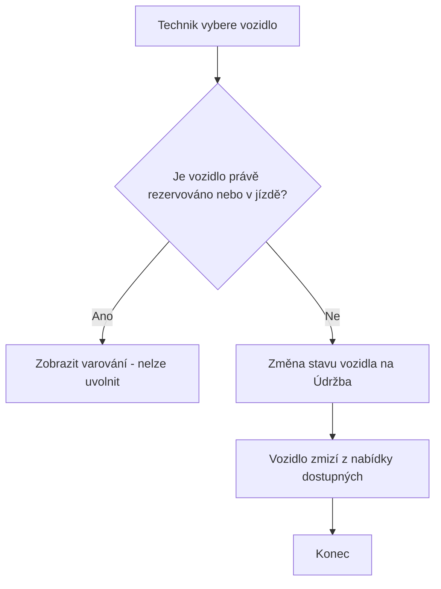

### 1.3.7 Potvrzení nabití vozidla (servisní technik)

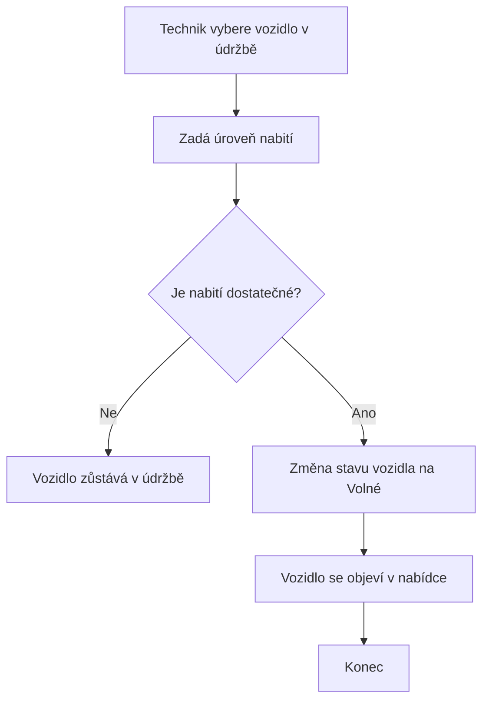

### 1.3.8 Testovací jízda technika (konflikt K3)

Tok je shodný s rezervací a jízdou běžného uživatele (1.3.1) – liší se jen tím,
že se podle role uživatele v okamžiku vytvoření rezervace označí jako testovací
a po ukončení jízdy se přeskočí fakturace.

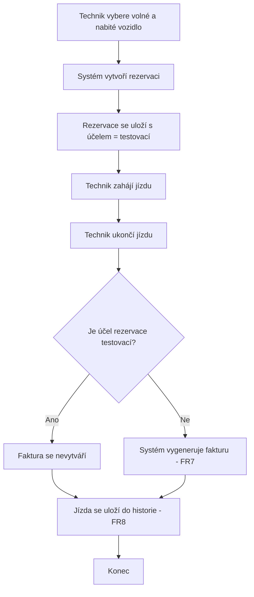

---

## 1.4 Funkční požadavky

Priorita je uvedena podle metody MoSCoW zjednodušené na tři úrovně:
**Vysoká** (musí být), **Střední** (mělo by být), **Nízká** (mohlo by být).

| ID | Požadavek | Priorita | Zdroj | Možná rizika | Závislosti |
|----|-----------|----------|-------|--------------|------------|
| FR1 | Systém umožní registraci a přihlášení uživatele. | Vysoká | Analýza (scénář předpokládá uživatele) | Slabá hesla, zneužití účtu | – |
| FR2 | Systém zobrazí dostupná vozidla na mapě. | Vysoká | Scénář (integrace s mapou) | Výpadek externí mapové služby | FR14 |
| FR3 | Uživatel může rezervovat volné a dostatečně nabité vozidlo. | Vysoká | Scénář (rezervace) | Souběžná rezervace stejného vozidla | FR1, FR14 |
| FR4 | Uživatel může zrušit svou aktivní rezervaci. | Střední | Analýza | Zrušení již ukončené rezervace | FR3 |
| FR5 | Rezervace automaticky vyprší po stanoveném čase, pokud jízda nezačne. | Střední | Analýza (viz konflikt K1) | Nejasná délka platnosti | FR3 |
| FR6 | Uživatel může zahájit a ukončit jízdu z rezervovaného vozidla. | Vysoká | Scénář (historie jízd) | Nekonzistentní stav při chybě | FR3 |
| FR7 | Systém po ukončení jízdy vygeneruje fakturu. | Vysoká | Scénář (fakturace) | Chybný výpočet ceny | FR6 |
| FR7a | Testovací jízda technika (viz K3) se nefakturuje. | Střední | Konflikt K3 | Technik zneužije testovací jízdu k běžnému provozu | FR7, FR12 |
| FR8 | Uživatel může zobrazit historii svých jízd a faktur. | Střední | Scénář (historie jízd) | Únik dat jiného uživatele | FR6, FR7 |
| FR9 | Admin může spravovat uživatele (vytvořit, upravit, zablokovat). | Vysoká | Scénář (správa uživatelů) | Náhodné zablokování aktivního uživatele | FR1 |
| FR10 | Admin může měnit role a oprávnění uživatelů. | Vysoká | Scénář (oprávnění) | Eskalace oprávnění | FR9 |
| FR11 | Admin může přidat nebo odebrat vozidlo z flotily. | Střední | Analýza | Odebrání rezervovaného vozidla | FR14 |
| FR12 | Servisní technik může označit vozidlo do údržby. | Vysoká | Scénář (stav vozidel) | Označení právě používaného vozidla | FR14 |
| FR13 | Servisní technik může potvrdit nabití a uvolnit vozidlo. | Střední | Analýza | Uvolnění nedostatečně nabitého vozidla | FR12, FR14 |
| FR14 | Systém sleduje stav každého vozidla (volné / rezervováno / v jízdě / údržba). | Vysoká | Scénář (sledování stavu) | Nekonzistence stavu mezi komponentami | – |

---

## 1.5 Nefunkční požadavky

| ID | Požadavek | Priorita | Zdroj | Možná rizika | Závislosti |
|----|-----------|----------|-------|--------------|------------|
| NFR1 | Odezva REST API bude do 500 ms u 95 % požadavků. | Střední | Analýza (použitelnost) | Zpomalení při vyšší zátěži | NFR4 |
| NFR2 | Dostupnost systému bude alespoň 99,5 % měsíčně. | Střední | Analýza (provozní požadavek) | Výpadek databáze nebo mapy | – |
| NFR3 | Hesla budou uložena v hashované podobě a přístup bude řízen podle rolí. | Vysoká | Analýza (bezpečnost) | Únik databáze, chybná autorizace | FR1, FR10 |
| NFR4 | Systém zvládne alespoň 500 souběžných uživatelů. | Nízká | Analýza (škálovatelnost) | Nedostatečné zdroje | – |
| NFR5 | Osobní údaje budou zpracovány v souladu s GDPR. | Vysoká | Legislativa | Právní postih při porušení | FR8 |
| NFR6 | Systém bude modulární, aby šel snadno rozšiřovat (viz kap. 6). | Střední | Analýza (udržovatelnost) | Těsná provázanost komponent | – |

---

## 1.6 Konfliktní a nejasné požadavky

Během analýzy vzniklo několik nejasností a konfliktů. U každého je uvedeno
navržené řešení.

### K1 – Jak dlouho drží rezervace vozidlo blokované?

**Problém:** Scénář uvádí rezervaci vozidla, ale neříká, jak dlouho zůstane
vozidlo rezervované, pokud uživatel jízdu nezahájí. Dlouhá rezervace blokuje
vozidlo ostatním (konflikt mezi FR3 a dostupností vozidel pro ostatní).

**Řešení:** Zavedeme časový limit platnosti rezervace (30 minut). Po jeho
vypršení se rezervace automaticky zruší a vozidlo se uvolní (požadavek FR5).
Konkrétní hodnota je konfigurovatelná, ale měnit ji smí pouze administrátor.

### K2 – Platí uživatel za dobu rezervace, nebo jen za jízdu?

**Problém:** Není jasné, zda se účtuje čas rezervace (než uživatel dojde
k vozidlu), nebo až samotná jízda. Obchodní pohled (účtovat rezervaci) je
v konfliktu s očekáváním uživatele (platit jen za jízdu).

**Řešení:** V první verzi se účtuje pouze samotná jízda (od zahájení do ukončení).
Rezervace do vypršení limitu je zdarma. Případné poplatky za rezervaci nad limit
jsou ponechány na pozdější iteraci (viz kap. 6).

### K3 – Může servisní technik zároveň rezervovat vozidla jako běžný uživatel?

**Problém:** Role technika není v zadání přesně ohraničená. Není jasné, zda má
i práva běžného uživatele.

**Řešení:** Technik smí kromě označení vozidla do údržby (FR12) vozidlo i
rezervovat – jde o testovací jízdu. Logika rezervace i jízdy je stejná jako
u běžného uživatele (FR3, FR6), ale jízda se mu nefakturuje (viz FR7a).

Účel rezervace ("běžná" / "testovací") se určí podle role uživatele v okamžiku
vytvoření rezervace a uloží se přímo na rezervaci – nejde tedy o odvozování
z aktuální role uživatele až při fakturaci. Díky tomu je rozhodnutí auditovatelné
zpětně v datech a odolné vůči pozdější změně role uživatele. Testovací jízda se
v historii jízd zobrazuje stejně jako běžnému uživateli (FR8).

Otevřenou otázkou zůstává autorizace – REST API dnes neověřuje identitu volajícího
(`uzivatel_id` posílá klient sám), takže rozlišení role je zatím jen na úrovni
databáze. Řešení autentizace je součástí budoucího jednoduchého frontendu.

### K4 – Lze rezervovat vozidlo s nízkým stavem nabití?

**Problém:** Konflikt mezi FR3 (rezervace) a provozní bezpečností. Málo nabité
vozidlo by nemuselo dojet do cíle.

**Řešení:** Zavedeme minimální úroveň nabití (např. 20 %), pod kterou vozidlo
nelze rezervovat a je automaticky nabídnuto technikovi k nabití. Kontrola je
součástí rezervační logiky (FR3).
