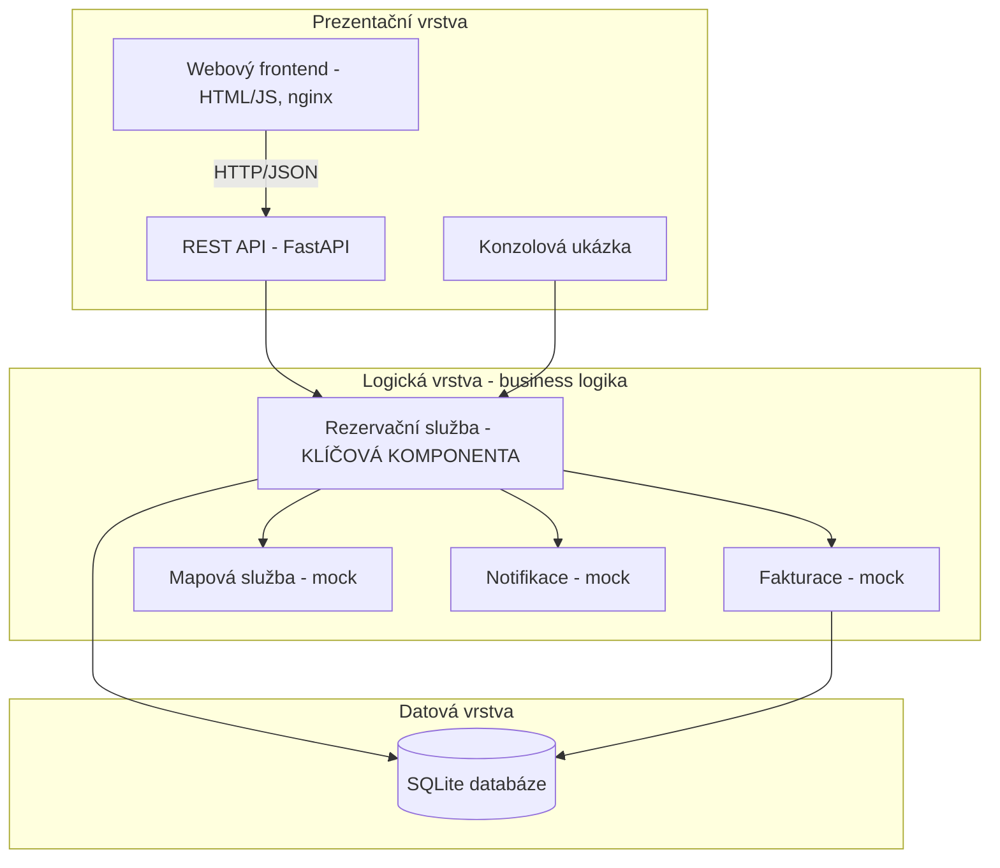
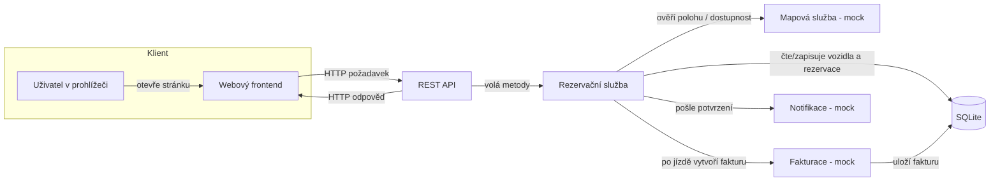

# 2. Softwarová architektura

## 2.1 Volba architektury

Pro systém byla zvolena **vrstvená architektura (layered / monolitická)**, nikoli
mikroslužby.

### Zdůvodnění

Zvažovány byly dvě varianty:

**Vrstvená architektura (zvolená):**
- Systém je v této fázi malý a spravuje ho jeden tým – monolit je jednodušší na
  vývoj, nasazení i testování.
- Jednotlivé odpovědnosti se dají čistě oddělit do vrstev (prezentace, logika,
  data), takže kód zůstává přehledný a snadno rozšiřitelný (splňuje NFR6).
- Nižší provozní režie – jedna aplikace, jedna databáze, žádná složitá
  komunikace po síti mezi službami.

**Mikroslužby (zamítnuty pro tuto fázi):**
- Přinesly by zbytečnou složitost (síťová komunikace, distribuované transakce,
  více nasazení) pro systém, který zatím nemá velkou zátěž ani velký tým.
- Mají smysl až při růstu (mnoho měst, vysoká zátěž) – proto jsou uvedeny jako
  možná evoluce v kapitole 6.

Vrstvená architektura je zároveň dobrým výchozím bodem: jednotlivé vrstvy a
komponenty jsou navrženy tak, aby z nich šlo v budoucnu vyčlenit samostatné
služby, pokud to bude potřeba.

Volba se potvrdila i v praxi: když k systému přibyl webový frontend, nevyžádal
si žádnou změnu rezervační služby ani datové vrstvy - jde jen o dalšího
klienta REST API, stejně jako `curl` nebo konzolová ukázka.

## 2.2 Vrstvy systému

- **Prezentační vrstva** – přijímá požadavky zvenčí. Obsahuje REST API (FastAPI)
  pro webové volání, webový frontend (statické HTML/JS servírované přes nginx,
  komunikuje s API jen přes HTTP/JSON) a konzolovou ukázku, která demonstruje
  komunikaci komponent přímo přes rezervační službu.
- **Logická vrstva** – jádro systému. Obsahuje rezervační službu (klíčová
  komponenta) a pomocné služby fakturace, mapy a notifikací (v této fázi mocky).
- **Datová vrstva** – SQLite databáze, přístup přes jednoduchý modul `database.py`.

## 2.3 Diagram komponent a interakce

Následující diagram ukazuje hlavní komponenty a to, jak spolu komunikují při
rezervaci a jízdě. Podle zadání nejde o striktní UML.

### Popis interakcí

1. **Uživatel → Frontend → REST API** – uživatel klikne v prohlížeči (např.
   "rezervovat vozidlo"), frontend z toho sestaví HTTP požadavek na API. Stejně
   se dá API volat i přímo (curl/Postman) - frontend v tom nemá žádné výsadní
   postavení, je to jen další klient.
2. **REST API → Rezervační služba** – API zavolá odpovídající metodu služby.
   Samo neobsahuje business logiku, jen převádí HTTP na volání služby.
3. **Rezervační služba → Databáze** – služba načte stav vozidla a uživatele,
   ověří podmínky (volné vozidlo, dostatečné nabití, neblokovaný uživatel) a
   uloží novou rezervaci.
4. **Rezervační služba → Mapová služba** – ověří / doplní informace o poloze
   vozidla (v této fázi mock, který vrací připravená data).
5. **Rezervační služba → Fakturace** – po ukončení jízdy si vyžádá vytvoření
   faktury; fakturace spočítá cenu a uloží ji.
6. **Rezervační služba → Notifikace** – odešle uživateli potvrzení (mock tiskne
   na stdout).
7. **REST API → Frontend** – vrátí výsledek operace (např. ID rezervace nebo
   chybu); frontend ho promítne do UI.

## 2.4 Mapování komponent na soubory

Aby report a kód na sebe navazovaly, každá komponenta odpovídá jednomu souboru:

| Komponenta | Soubor | Odpovědnost |
|------------|--------|-------------|
| Datová vrstva | `src/database.py` | Vytvoření tabulek a přístup k datům (SQLite) |
| Rezervační služba (klíčová) | `src/reservation_service.py` | Rezervace, kontroly stavu, jízdy |
| Fakturace (mock) | `src/billing.py` | Výpočet a uložení faktury |
| Mapová služba (mock) | `src/maps.py` | Poloha a dostupnost vozidel |
| Notifikace (mock) | `src/notifications.py` | Odeslání zpráv uživateli |
| Konzolová ukázka | `src/console_demo.py` | Demonstrace komunikace komponent |
| REST API | `src/main.py` | HTTP rozhraní nad rezervační službou |
| Webový frontend | `frontend/index.html`, `frontend/app.html`, `frontend/js/*.js` | Statické UI (přihlášení, rezervace, admin/technik panely) nad REST API, žádný build krok |

## 2.5 Nasazení (Docker)

Systém se dá spustit i přes `docker-compose.yml` v kořeni repozitáře - dvě
samostatné služby, každá s vlastním Dockerfile:

- **`api`** (`src/Dockerfile`) – Python/uvicorn, databáze žije v adresáři
  `/app/data` odděleném od kódu (`/app/src`), na který je připojený
  pojmenovaný Docker volume (`api_data`). Díky tomu data přežijí
  `docker compose down` i `--build` (NFR7) a zároveň rebuild image s novým
  kódem volume nezastíní.
- **`frontend`** (`frontend/Dockerfile`) – nginx servírující statické soubory.
  Adresa API se do frontendu propisuje za běhu kontejneru přes proměnnou
  prostředí `API_BASE_URL` (`docker-entrypoint.sh` přegeneruje `js/config.js`).
  nginx zároveň posílá `Cache-Control: no-store` pro všechny statické soubory
  - bez toho hrozilo, že prohlížeč drží starou verzi JS proti nové verzi HTML
  (a naopak) po každém update frontendu.

Obě služby lze verzovat nezávisle (viz `GET /verze` a `frontend/js/verze.js`,
NFR/FR20) - odpovídá tomu, že jde o dva samostatně nasaditelné artefakty.
