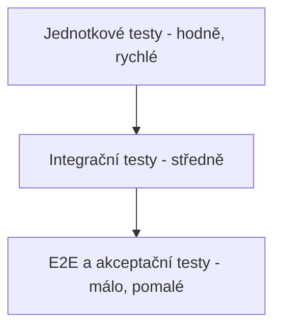

# 5. Testování softwaru

## 5.1 Implementované testy

Pro rezervační komponentu je napsáno 8 testů (`src/test_reservation.py`),
jednotkových i integračních. Všechny procházejí (`8 passed`).

| Test | Typ | Co ověřuje |
|------|-----|------------|
| `test_rezervace_uspesna` | jednotkový | Úspěšná rezervace, vozidlo přejde do stavu „rezervováno" |
| `test_rezervace_malo_nabiteho_vozidla` | jednotkový | Odmítnutí vozidla pod 20 % nabití (K4) |
| `test_rezervace_neexistujiciho_vozidla` | jednotkový | Ošetření neexistujícího vozidla |
| `test_rezervace_zablokovaneho_uzivatele` | jednotkový | Zablokovaný uživatel nemůže rezervovat |
| `test_zruseni_rezervace_uvolni_vozidlo` | jednotkový | Po zrušení je vozidlo zase volné |
| `test_zahajeni_jizdy_po_vyprseni_rezervace` | jednotkový | Vypršelá rezervace (K1) nedovolí jízdu |
| `test_cely_tok_rezervace_az_faktura` | integrační | Celý tok rezervace → jízda → faktura, kontrola částky |
| `test_api_rezervace_pres_endpoint` | integrační | REST API přes TestClient (GET /vozidla, POST /rezervace) |

Testy používají databázi v paměti (`:memory:`), takže jsou rychlé, nezávislé na
sobě a nemění reálná data. API test si na začátku vytvoří čistou databázi.

## 5.2 Plán testování celého systému

### 5.2.1 Typy testů

- **Jednotkové testy** – testují jednotlivé funkce a metody v izolaci (např.
  kontroly v rezervační službě). Rychlé, pouštějí se při každé změně kódu.
- **Integrační testy** – testují spolupráci komponent (rezervační služba +
  databáze + fakturace + API). Odhalí chyby v rozhraních mezi komponentami.
- **End-to-end (E2E) testy** – testují celý systém z pohledu uživatele, od HTTP
  požadavku po zápis do databáze. U webového API se dají realizovat voláním
  reálných endpointů (např. přes nástroj jako Postman nebo automatizovaně).
- **Akceptační testování** – ověřuje, že systém splňuje požadavky zadavatele.
  Vychází z funkčních požadavků (kap. 1.4), např. „uživatel dokáže rezervovat a
  odjet vozidlem". Provádí se se zadavatelem před nasazením.

### 5.2.2 Metody návrhu testů

- **Blackbox (černá skříňka)** – testy se navrhují jen podle vstupů a
  očekávaných výstupů, bez znalosti vnitřní implementace. Vhodné pro akceptační
  a API testy. Používá se např. testování hraničních hodnot (nabití přesně
  19 %, 20 %, 21 %) a rozdělení do tříd ekvivalence.
- **Whitebox (bílá skříňka)** – testy vycházejí ze znalosti kódu a snaží se
  projít všechny větve. Např. u metody `vytvor_rezervaci` pokrýt každou
  podmínku (neexistující uživatel, zablokovaný uživatel, obsazené vozidlo,
  nízké nabití, úspěch). Měří se pokrytí kódu (code coverage).

### 5.2.3 Další techniky zajištění kvality

- **Statická analýza** – nástroje jako `flake8`, `pylint` nebo `mypy` (kontrola
  typů) odhalí chyby a nekonzistence bez spuštění kódu. Zařazují se do CI.
- **CI/CD datovod (pipeline)** – při každém pushnutí do repozitáře se
  automaticky spustí statická analýza a testy. Pokud projdou, kód se může
  automaticky nasadit (např. GitHub Actions, GitLab CI). Zabraňuje tomu, aby se
  do hlavní větve dostal nefunkční kód.
- **Strategie shift-left** – testování a kontrola kvality se posouvají co
  nejdříve do vývoje (psaní testů spolu s kódem, kontrola už při psaní), místo
  aby se testovalo až na konci. Chyby se tak odhalí dříve a levněji.
- **Code review** – změny prochází revizí druhého vývojáře před sloučením.

### 5.2.4 Návrh testovací pyramidy pro tento systém

Základ tvoří velké množství rychlých jednotkových testů, nad nimi méně
integračních a nahoře jen několik E2E a akceptačních testů. Tím se udrží rychlá
zpětná vazba a zároveň jistota, že systém funguje jako celek.
