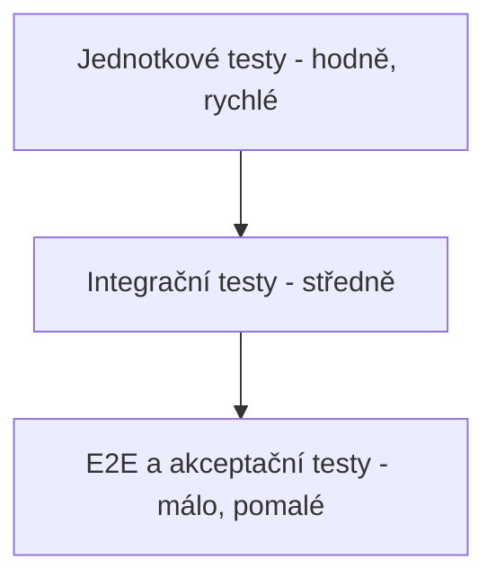

# 5. Testování softwaru

## 5.1 Implementované testy

Pro rezervační komponentu je napsáno 35 testů (`src/test_reservation.py`),
jednotkových i integračních. Všechny procházejí (`35 passed`).

**Základní rezervace a jízda**

| Test | Typ | Co ověřuje |
|------|-----|------------|
| `test_rezervace_uspesna` | jednotkový | Úspěšná rezervace, vozidlo přejde do stavu „rezervováno" |
| `test_rezervace_vraci_platnost_do_pro_countdown` | jednotkový | Odpověď obsahuje `platnost_do` pro countdown (FR17) |
| `test_rezervace_malo_nabiteho_vozidla` | jednotkový | Odmítnutí vozidla pod 20 % nabití (K4) |
| `test_rezervace_neexistujiciho_vozidla` | jednotkový | Ošetření neexistujícího vozidla |
| `test_rezervace_zablokovaneho_uzivatele` | jednotkový | Zablokovaný uživatel nemůže rezervovat |
| `test_zruseni_rezervace_uvolni_vozidlo` | jednotkový | Po zrušení je vozidlo zase volné |

**Platnost rezervace (K1)**

| Test | Typ | Co ověřuje |
|------|-----|------------|
| `test_vychozi_platnost_rezervace_je_30_minut` | jednotkový | Výchozí limit 30 minut |
| `test_admin_muze_zmenit_platnost_rezervace` | jednotkový | Admin může změnit limit |
| `test_bezny_uzivatel_nemuze_zmenit_platnost_rezervace` | jednotkový | Běžný uživatel nemůže změnit limit |
| `test_nova_rezervace_pouziva_zmeneny_limit` | jednotkový | Nová rezervace použije aktuální limit |
| `test_vyprsela_rezervace_uvolni_vozidlo_bez_zahajeni_jizdy` | jednotkový | Vypršelá rezervace se uklidí i bez pokusu o jízdu |
| `test_zahajeni_jizdy_po_vyprseni_rezervace` | jednotkový | Vypršelá rezervace nedovolí jízdu |

**Testovací jízda technika (K3)**

| Test | Typ | Co ověřuje |
|------|-----|------------|
| `test_rezervace_technika_je_testovaci` | jednotkový | Rezervace technika se uloží s účelem "testovací" |
| `test_rezervace_bezneho_uzivatele_je_bezna` | jednotkový | Rezervace běžného uživatele je "běžná" |
| `test_testovaci_jizda_technika_negeneruje_fakturu` | jednotkový | Testovací jízda nevytvoří fakturu, ale je v historii |

**Admin - uživatelé, flotila, faktury**

| Test | Typ | Co ověřuje |
|------|-----|------------|
| `test_admin_muze_vytvorit_uzivatele` | jednotkový | Admin vytvoří uživatele |
| `test_bezny_uzivatel_nemuze_vytvorit_uzivatele` | jednotkový | Neautorizovaný pokus je odmítnut (K5) |
| `test_admin_muze_zablokovat_a_odblokovat_uzivatele` | jednotkový | (Od)blokování uživatele |
| `test_admin_muze_zmenit_roli_uzivatele` | jednotkový | Změna role uživatele |
| `test_admin_muze_pridat_a_odebrat_vozidlo` | jednotkový | Přidání a odebrání vozidla z flotily |
| `test_nelze_odebrat_vozidlo_s_aktivni_rezervaci` | jednotkový | Odebrání vozidla s aktivní rezervací je odmítnuto |
| `test_admin_vidi_aktivniho_uzivatele_rezervovaneho_vozidla` | jednotkový | Admin vidí jméno u rezervovaného vozidla (FR18) |
| `test_volne_vozidlo_nema_aktivniho_uzivatele` | jednotkový | U volného vozidla je aktivní uživatel `None` |
| `test_admin_vidi_vsechny_faktury` | jednotkový | Přehled faktur všech uživatelů (FR19) |
| `test_admin_muze_filtrovat_faktury_podle_vozidla_a_uzivatele` | jednotkový | Filtrování faktur podle vozidla/uživatele |

**Servis vozidla, baterie (K4)**

| Test | Typ | Co ověřuje |
|------|-----|------------|
| `test_technik_muze_oznacit_a_ukoncit_servis` | jednotkový | Technik označí vozidlo do servisu a ukončí ho |
| `test_ukonceni_servisu_s_nizkym_nabitim_necha_vozidlo_v_udrzbe` | jednotkový | Nedostatečné nabití po servisu nechá vozidlo v údržbě |
| `test_bezny_uzivatel_nemuze_oznacit_vozidlo_do_servisu` | jednotkový | Neautorizovaný pokus je odmítnut (K5) |
| `test_ukonceni_jizdy_snizi_nabiti_podle_ujete_vzdalenosti` | jednotkový | Nabití klesne o `ujeto_km × 0,3 %` (FR15) |
| `test_ukonceni_jizdy_nesnizi_nabiti_pod_nulu` | jednotkový | Nabití nikdy neklesne pod 0 |
| `test_vozidlo_jde_automaticky_do_servisu_pri_nizkem_nabiti_po_jizde` | jednotkový | Nízké nabití po jízdě → automatická údržba (FR16) |
| `test_vozidlo_zustava_volne_kdyz_nabiti_neklesne_pod_minimum` | jednotkový | Hraniční hodnota (přesně 20 %) zůstává "volné" |
| `test_ukonceni_jizdy_odmitne_vzdalenost_nad_dojezd_vozidla` | jednotkový | Jízda nad reálný dojezd je odmítnuta (bugfix #14) |

**Integrační testy**

| Test | Typ | Co ověřuje |
|------|-----|------------|
| `test_cely_tok_rezervace_az_faktura` | integrační | Celý tok rezervace → jízda → faktura, kontrola částky |
| `test_api_rezervace_pres_endpoint` | integrační | REST API přes TestClient (`/vozidla`, `/rezervace`, `/verze`, `/uzivatele`) |

Testy používají databázi v paměti (`:memory:`), takže jsou rychlé, nezávislé na
sobě a nemění reálná data. API test si na začátku vytvoří čistou databázi.

## 5.2 Plán testování celého systému

### 5.2.1 Typy testů

- **Jednotkové testy** – testují jednotlivé funkce a metody v izolaci (např.
  kontroly v rezervační službě). Rychlé, pouštějí se při každé změně kódu.
- **Integrační testy** – testují spolupráci komponent (rezervační služba +
  databáze + fakturace + API). Odhalí chyby v rozhraních mezi komponentami.
- **End-to-end (E2E) testy** – testují celý systém z pohledu uživatele, od HTTP
  požadavku po zápis do databáze. U webového API se dají realizovat voláním
  reálných endpointů (např. přes nástroj jako Postman nebo automatizovaně).
- **Akceptační testování** – ověřuje, že systém splňuje požadavky zadavatele.
  Vychází z funkčních požadavků (kap. 1.4), např. „uživatel dokáže rezervovat a
  odjet vozidlem". Provádí se se zadavatelem před nasazením.

### 5.2.2 Metody návrhu testů

- **Blackbox (černá skříňka)** – testy se navrhují jen podle vstupů a
  očekávaných výstupů, bez znalosti vnitřní implementace. Vhodné pro akceptační
  a API testy. Používá se např. testování hraničních hodnot (nabití přesně
  19 %, 20 %, 21 %) a rozdělení do tříd ekvivalence.
- **Whitebox (bílá skříňka)** – testy vycházejí ze znalosti kódu a snaží se
  projít všechny větve. Např. u metody `vytvor_rezervaci` pokrýt každou
  podmínku (neexistující uživatel, zablokovaný uživatel, obsazené vozidlo,
  nízké nabití, úspěch). Měří se pokrytí kódu (code coverage).

### 5.2.3 Další techniky zajištění kvality

- **Statická analýza** – nástroje jako `flake8`, `pylint` nebo `mypy` (kontrola
  typů) odhalí chyby a nekonzistence bez spuštění kódu. Zařazují se do CI.
- **CI/CD datovod (pipeline)** – při každém pushnutí do repozitáře se
  automaticky spustí statická analýza a testy. Pokud projdou, kód se může
  automaticky nasadit (např. GitHub Actions, GitLab CI). Zabraňuje tomu, aby se
  do hlavní větve dostal nefunkční kód.
- **Strategie shift-left** – testování a kontrola kvality se posouvají co
  nejdříve do vývoje (psaní testů spolu s kódem, kontrola už při psaní), místo
  aby se testovalo až na konci. Chyby se tak odhalí dříve a levněji.
- **Code review** – změny prochází revizí druhého vývojáře před sloučením.

### 5.2.4 Návrh testovací pyramidy pro tento systém

Základ tvoří velké množství rychlých jednotkových testů, nad nimi méně
integračních a nahoře jen několik E2E a akceptačních testů. Tím se udrží rychlá
zpětná vazba a zároveň jistota, že systém funguje jako celek.
